# MobiusEMS System Architecture Specification

## 1. System Boundaries & Runtime Separation

MobiusEMS is an independent enterprise-grade workforce capability, work delivery, performance intelligence, and commercial operations platform engineered for `employee.whalexy.com`.

- **Autonomous Runtime**: MobiusEMS runs on Node.js 20+ and Express 4. It does not share memory, filesystem, or database infrastructure with the legacy Laravel application at `whalexy.com`.
- **API & SPA Topology**: In production, the Express server hosts the REST API mounted under `/api/v1/*` and statically serves the production-compiled React 19 SPA (`client/dist`) with an immutable client-side asset caching strategy and single-page application (SPA) routing fallback.
- **Tenant Boundary**: Multi-tenancy is enforced at the persistence layer using a central fail-closed Mongoose model wrapper and Node.js `AsyncLocalStorage`. Every database query, aggregation, mutation, and background job is strictly bound to the authenticated tenant.

## 2. Monorepo Structure & Package Responsibilities

MobiusEMS is architected as an npm workspace monorepo divided into three decoupled packages:

```text
mobius-ems/
├── client/                     React 19 + TypeScript + Vite Frontend Application
│   ├── src/
│   │   ├── api/                TanStack Query configurations and global HTTP fetchers
│   │   ├── components/         Reusable UI primitives and design system tokens
│   │   ├── features/           Domain-scoped modules (sales, attendance, performance, ai, etc.)
│   │   ├── hooks/              Shared React hooks (auth, debounce, toast, viewport)
│   │   ├── layouts/            AppLayout, authenticated shell, top navigation, sidebar
│   │   ├── pages/              Route entrypoint views (41 production pages)
│   │   ├── routes/             Route guards (ProtectedRoute, RoleRoute, PermissionRoute)
│   │   ├── services/           Client-side API adapters
│   │   ├── store/              Global client state management
│   │   └── types/              Frontend view types and UI view models
├── server/                     Node.js 20 + Express 4 Backend REST API & Services
│   ├── src/
│   │   ├── config/             Zod-validated environment configuration (`env.ts`)
│   │   ├── constants/          System constants and default dictionaries
│   │   ├── controllers/        HTTP request/response translation layer
│   │   ├── data/               Preset catalogs, role definitions, and seed data
│   │   ├── jobs/               Database migrations, backups, and integrity verification
│   │   ├── middleware/         Authentication, RBAC, Helmet, CORS, rate limits, validation
│   │   ├── models/             62 Mongoose domain models with fail-closed tenant scoping
│   │   ├── routes/             19 versioned route modules mounted under `/api/v1`
│   │   ├── services/           54 domain business services, scoring math, AI, and STT
│   │   ├── tenancy/            AsyncLocalStorage context, model wrappers, migration engine
│   │   ├── types/              Server-side internal domain interfaces
│   │   ├── utils/              AppError, asyncHandler, formatters, and crypto utilities
│   │   └── validators/         Zod boundary validation schemas for all mutating endpoints
├── shared/                     Shared TypeScript Package (`@mobius-ems/shared`)
│   └── src/                    Single source of truth for Roles, Permissions, DTOs, and Contracts
├── docs/                       Architecture, multi-tenancy runbook, and schema blueprints
└── package.json                Root scripts for dev, build, typecheck, lint, seed, test, ops
```

## 3. High-Level System Architecture

```mermaid
flowchart TB
    subgraph ClientLayer ["Client Presentation Tier (React 19 SPA)"]
        UI["React 19 + Vite + Tailwind CSS"]
        Router["React Router v7 (41 Route Pages)"]
        State["TanStack React Query v5 Cache"]
        MapEngine["Leaflet / React Leaflet GIS Mapping"]
        AudioRec["Browser MediaRecorder (WebM/WAV)"]
    end

    subgraph GatewayLayer ["Application Gateway & Security Layer"]
        Helmet["Helmet (CSP, HSTS, Sniff Guard)"]
        CORS["Restricted CORS (CLIENT_URL)"]
        OriginCheck["State-Changing Origin Verification"]
        RateLimiter["express-rate-limit (200 req/min)"]
        CookieParser["HttpOnly Secure Cookie Parser"]
        AuthGuard["JWT Verification & Session Family Check"]
        TenancyContext["AsyncLocalStorage Tenant Context Injector"]
        ZodValidator["Zod Boundary Request Validator"]
    end

    subgraph ServiceLayer ["Domain Services & Deterministic Engines"]
        AuthSvc["Auth & Tenant Onboarding Service"]
        OrgSvc["Organization & Employee 360 Service"]
        WorkSvc["Project & Kanban State Machine"]
        VoiceSvc["Multilingual Voice-to-Task (11 Languages)"]
        PerfMath["Deterministic Performance & KPI Engine"]
        ContribMath["Deterministic Contribution Engine"]
        SalesMath["Sales Analytics & 3-Tier Scoping (SELF/TEAM/ALL)"]
        GeoSvc["Hierarchical GIS Engine (Global-to-Area)"]
        AttSvc["Haversine Geofenced Attendance Engine"]
        EmailSvc["Brevo Transactional Workflow Engine"]
        LLMAdapter["Multi-Provider LLM Service (Groq/OpenAI/Claude/Gemini)"]
    end

    subgraph PersistenceLayer ["Persistence & External Infrastructure"]
        MongoDB[("MongoDB Atlas (62 Tenant-Scoped Collections)")]
        LocalWhisper["faster-whisper (Local Server-Side STT)"]
        Cloudinary["Cloudinary (Private Authenticated Files)"]
        BrevoAPI["Brevo API / Nodemailer (SMTP Gateway)"]
        LLMProviders["Upstream LLMs (Groq, OpenAI, Anthropic, Gemini)"]
    end

    ClientLayer --> GatewayLayer
    GatewayLayer --> ServiceLayer
    ServiceLayer --> PersistenceLayer
```



## 4. Comprehensive Domain & Model Map (62 Models)

Every business collection enforces an immutable `tenantId` leading compound index, soft-deletion timestamps (`isActive`, `archivedAt`, `deletedAt`), and strict service-level field allowlisting:

| Domain | Key Collections / Models | Architectural Responsibility |
|---|---|---|
| **Identity & Access** | `User`, `Role`, `Permission`, `RefreshSession` | Enterprise RBAC, SHA-256 hashed refresh tokens, token family revocation on reuse, forced password rotation, resumable onboarding. |
| **Tenancy & Platform** | `Tenant`, `SystemMigration` | Multi-tenant lifecycle management, tenant provisioning, suspension isolation, automated preflight and idempotent migration tracking. |
| **Organization Structure** | `Employee`, `Department`, `Team`, `Designation`, `EmployeeTimeline` | Org tree hierarchy, reporting chains, designation skill prerequisites, career timeline, and Employee 360 longitudinal profiles. |
| **Capability & Skills** | `Skill`, `EmployeeSkill`, `SkillVerification`, `Assessment`, `AssessmentResult`, `RoleSkillAssessment` | Verified capability matrices, immutable skill verification audit trails, timed technical assessments, role-gap analytics, and org heatmaps. |
| **Work Delivery** | `Project`, `Task`, `TaskActivity`, `VoiceCommand`, `WeeklyUpdate` | Project portfolios, validated task state transitions, blocker root cause tracking, append-only audit trail, and voice command transcripts. |
| **Performance & Outcomes** | `Goal`, `KPI`, `EmployeeKPI`, `PerformanceReview`, `PerformanceSnapshot`, `PerformanceTemplate` | Objective key results, department/role KPI tracking, 360 review workflows, and immutable, explainable weighted performance snapshots. |
| **Contribution Tracking** | `ContributionReview`, `ContributionSnapshot` | Structured weekly contribution evidence, manager review cycle, and deterministic contribution scoring. |
| **Attendance & Geofencing** | `Attendance`, `AttendanceOffice` | Mobile-ready daily check-in/out, Haversine spherical distance calculation (300m radius), GPS accuracy validation, 11:30 AM IST late cutoff, and half-day hours thresholds. |
| **Growth & Development** | `Training`, `EmployeeTraining`, `Recognition`, `OneToOne` | Learning management, course assignments, peer recognition/kudos, and structured 1-on-1 manager-employee meeting cadences. |
| **People Operations** | `Applicant`, `ResumeScreening`, `JobDescription`, `LeaveRequest` | Job requisitions, automated PDF/DOCX resume text extraction, assistive screening summaries, and paid time off (PTO) leave workflows. |
| **Sales Intelligence & Maps** | `GeoNode`, `SalesTerritory`, `EmployeeTerritoryAssignment`, `SalesLead`, `SalesCustomer`, `SalesOpportunity`, `SalesTarget`, `SalesRevenueTransaction`, `ChannelPartner`, `SalesConfiguration`, `GeoSalesMetricSnapshot`, `EmployeeTargetCommitment` | Canonical GIS tree (Global -> Country -> State -> District -> City -> Area -> Pincode), territory coverage, effective-dated staff assignments, lead-to-customer conversion, opportunity pipeline, automated revenue booking, channel partner network, and deterministic sales analytics. |
| **Governance & Security** | `Document`, `Notification`, `AuditLog` | Authenticated private file storage (Cloudinary signed downloads), in-app notifications, and append-only tamper-evident compliance audit logs. |
| **Email Automation** | `EmailWorkflow`, `EmailEnrollment`, `EmailDelivery` | Lifecycle drip email automation, multi-step triggers, daily rate limiting (250/day), Brevo API & webhook integration, and idempotency guarantees. |
| **AI & Personal Productivity** | `AiContentCache`, `AiEmployeeSummary`, `DailyTodo`, `VendorContact` | Advisory AI summaries, cached safe wellness/humor content, private employee daily to-do checklists (strictly isolated from performance scoring), and vendor contacts. |

## 5. API Routing Topology (19 Top-Level Modules)

The Express router (`server/src/routes/index.ts`) mounts 19 modular route controllers under `/api/v1`:

```text
/api/v1/auth                 Authentication lifecycle (login, refresh, logout, session verification)
/api/v1/registration         Tenant and employee onboarding & registration pipelines
/api/v1/dashboard            Role-scoped operational metrics and dashboard aggregations
/api/v1/employees            Employee lifecycle, career profiles, 360 review view, document association
/api/v1/organization         Departments, teams, designations, and organizational chart hierarchy
/api/v1/skills               Skills directory, employee self-claims, verification, and assessments
/api/v1/work                 Project portfolios, task board, state transitions, and voice-to-task commands
/api/v1/outcomes             Company goals, role KPIs, performance review workflows, and scoring snapshots
/api/v1/development          Training courses, employee enrollments, 1-on-1s, and peer recognitions
/api/v1/governance           Secure document storage, notification alerts, audit log explorer, role settings
/api/v1/people-ops           Recruitment pipelines, resume screening, JD library, and leave requests
/api/v1/attendance           Daily attendance check-in/out, office geofence administration, register summary
/api/v1/contribution         Weekly update logs, contribution evaluation, and historical scoring snapshots
/api/v1/ai                   Advisory employee performance summaries, policy assistant, Mood Break
/api/v1/todos                Private daily employee to-do checklists (decoupled from performance evaluation)
/api/v1/email-automation     Email marketing and onboarding drip workflows, enrollments, Brevo webhooks
/api/v1/platform/tenants     Multi-tenant provisioning, customer tenant suspension, migration preflight
/api/v1/sales                Sales leads, customers, pipeline opportunities, targets, revenue, territories, GIS
/api/v1/employee-map         Geospatial workforce distribution and office location mapping
```

## 6. Multi-Tenancy & Data Isolation Engine

Multi-tenancy in MobiusEMS is implemented as an architectural invariant, not an optional filter:

1. **AsyncLocalStorage Execution Context**: When a request arrives, authentication middleware verifies the JWT and establishes a request-isolated context containing `tenantId` and `isPlatformAdmin`.
2. **Fail-Closed Mongoose Model Wrapper**: Every tenant-owned model is registered through `withTenancy()`. The wrapper intercepts:
   - Queries (`find`, `findOne`, `countDocuments`): Automatically appends `{ tenantId }` to the query predicate. Conflicting tenant IDs provided in parameters trigger a fail-closed exception.
   - Mutations (`updateOne`, `updateMany`, `findOneAndUpdate`, `deleteMany`): Injects `{ tenantId }` into the query filter.
   - Insertions (`save`, `insertMany`): Injects `tenantId` into document payloads prior to validation.
   - Aggregations (`aggregate`): Automatically prepends a `$match: { tenantId }` pipeline stage as stage 0.
   - Direct Object Access (IDOR Prevention): Cross-tenant access by raw MongoDB `_id` is fundamentally rejected because queries always evaluate `_id AND tenantId`.
3. **Tenant-Local Uniqueness**: Unique business identifiers (email, employee ID, project code, department code, customer email) are indexed with tenant-leading compound unique indexes: `{ tenantId: 1, email: 1 }`.
4. **Global Platform Entities**: Only `Tenant` and `Permission` bypass tenant scoping. Access to `/api/v1/platform/*` endpoints requires the `SUPER_ADMIN` role and email allowlisting in `PLATFORM_ADMIN_EMAILS`.

## 7. AI & Voice Architecture

### 7.1 Multi-Provider LLM Abstraction
The AI service (`llmService.ts`) abstracts upstream LLM providers behind a unified interface:
- **Default Provider**: Groq running `llama-3.3-70b-versatile` for ultra-low latency inference.
- **Alternative Providers**: OpenAI (`gpt-4.1-mini`), Anthropic (`claude-sonnet-4-20250514`), Gemini (`gemini-2.5-flash`), Together (`Llama-3.3-70B-Instruct-Turbo`), OpenRouter, and generic OpenAI-compatible gateways.
- **Execution Parameters**: Deterministic low temperature (`0.2`), strict token budgets (default 900 tokens), and configurable abort timeouts (`AI_TIMEOUT_MS = 45000`).
- **Employment Decision Boundary**: AI output is strictly advisory. AI is prohibited by policy and code from making autonomous promotion, termination, salary, or disciplinary decisions.
- **Deterministic Math Separation**: All quantitative scoring (KPI calculation, performance scoring, contribution index, sales conversion rates, opportunity scoring) is executed by deterministic TypeScript math modules, completely decoupled from LLM generation.

### 7.2 Local Zero-Retention Voice-to-Task Pipeline
- **Speech-to-Text Engine**: Server-side local transcription powered by `faster-whisper` (`small` multilingual model, `int8` quantization). Eliminates recurring per-minute cloud STT costs.
- **Zero-Retention Audio Handling**: Audio received by the server is written to an ephemeral `mkdtemp` directory, transcribed by a local Python worker, and immediately wiped via `fs.rm` in a `finally` block. No voice audio is stored in persistent storage or databases.
- **Multilingual Heuristic NLP**: A dedicated 400+ line multilingual parsing engine (`voiceTaskService.ts`) supports English and 10 major Indian languages (Hindi, Bengali, Tamil, Telugu, Marathi, Gujarati, Kannada, Malayalam, Punjabi, Urdu).
- **Interactive Review**: Voice commands are converted into structured `VoiceDraft` previews allowing employees and managers to verify or edit assignees, estimated hours, and project associations before saving.

## 8. Deterministic Scoring & Analytics Engines

To eliminate algorithmic hallucination and ensure audit compliance, all core scores are computed deterministically:

1. **Performance Engine (`performanceMath.ts`)**: Computes weighted scores across Goals, Role KPIs, and Review Competencies based on tenant-configured weighting templates. Generates immutable `PerformanceSnapshot` records preserving raw inputs, weight formulas, and final grade brackets (`EXCEEDING`, `MEETING`, `NEEDS_IMPROVEMENT`, `UNSATISFACTORY`).
2. **Contribution Engine (`contributionMath.ts`)**: Evaluates employee weekly updates, project deliverables, and manager ratings into standardized contribution percentiles.
3. **Sales & Commercial Engine (`salesMath.ts`)**:
   - Computes weighted pipeline values, conversion velocity, and target achievements.
   - Bounded opportunity scoring: Evaluates lead demand score, coverage gap score, customer white space score, and pipeline potential score into normalized opportunity bands (`LOW`, `MEDIUM`, `HIGH`, `CRITICAL`).
   - Calculates estimated lost conversion revenue from delayed follow-ups using tenant SLA configurations.

## 9. Security & Governance Invariants

- **Session Security**: Dual-token pattern using HttpOnly, Secure, SameSite=Strict cookies. Refresh tokens rotate upon renewal; reuse attempts invalidate the entire session family.
- **Origin Guard**: `verifyRequestOrigin` middleware validates mutating HTTP requests against `CLIENT_URL` to block Cross-Site Request Forgery (CSRF).
- **Private Document Management**: Uploads are stored in Cloudinary as authenticated private assets with cryptographically random identifiers. Download URLs are short-lived and signed only after backend authorization checks.
- **Immutable Audit Trail**: The `AuditLog` collection records actor identity, IP, user agent, target entity, action type, and diff snapshots. No update or delete endpoints exist in the application.
