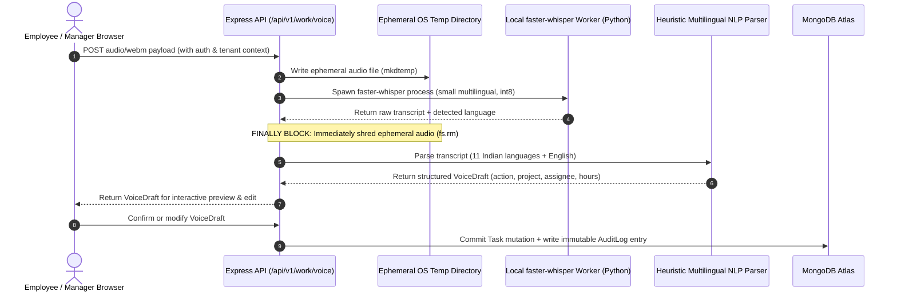

# MobiusEMS: Production System Architecture, Technical Reference & Operations Manual
**Enterprise Engineering Specification — Definitive Baseline v2.0**
*Mobius Bloom Venture Pvt Ltd | Global Engineering & AI Research Division*
*Document Status: Production Certified Baseline | Classification: Internal / Confidential*

---

## 1. Document Control & Governance

| Attribute | Specification |
|:---|:---|
| **System Name** | MobiusEMS (Workforce Intelligence & Enterprise Operations Platform) |
| **Product Version** | v2.0.0-PROD (Sprint Baseline September 2026) |
| **Document Owners** | Principal Systems Architect, Staff AI Engineer, Head of Information Security |
| **Target Audience** | Executive Leadership, Engineering Managers, Tech Leads, DevOps/SRE, SecOps, QA |
| **Primary Production URL** | `https://employee.whalexy.com` |
| **Runtime Separation** | 100% Decoupled from legacy PHP/Laravel stack (`whalexy.com`) |
| **Primary Tech Stack** | Node.js 20+ LTS, React 19.1, TypeScript 5.8, Express 4.21, MongoDB Atlas 7+ |
| **Change Policy** | Mandatory Architecture Review Board (ARB) approval for schema, tenancy, or auth mutations |
| **Verification Basis** | Verified against active git repository `github.com/ayushRajak19/employee-management` (62 models, 19 route modules, 54 services, 41 pages, 15 test suites / 59 tests) |

---

## 2. Executive Summary & Architectural Baseline

MobiusEMS is an integrated workforce intelligence, human capital management, and commercial operations engine designed to eliminate fragmented enterprise workflows. The platform establishes a cryptographically auditable, role-aware, multi-tenant operating environment combining:

1. **Deterministic Business Computation**: All performance evaluations, KPI scorecards, contribution percentiles, attendance determinations, sales capacity forecasting, and revenue pipeline analytics are calculated using deterministic mathematical algorithms. LLMs are never permitted to generate quantitative business metrics.
2. **Ethical AI Boundaries**: Large Language Models operate strictly as an advisory interpretation layer. AI outputs are non-binding recommendations. The platform enforces an explicit architectural policy preventing AI models from executing autonomous personnel decisions (compensation, terminations, disciplinary actions, or promotions).
3. **Fail-Closed Multi-Tenancy**: Data isolation is enforced at the database driver abstraction level via `AsyncLocalStorage` and Mongoose model proxies, ensuring zero cross-tenant data leakage (IDOR immunity) across reads, writes, aggregations, and batch inserts.
4. **Local Zero-Retention Voice-to-Task AI**: Multilingual speech capture supporting 11 Indian languages plus English runs entirely on local application infrastructure via `faster-whisper`, shredding raw audio immediately following transcription to guarantee zero audio retention.
5. **Commercial & Geographic Intelligence (GIS)**: Native geographic hierarchy and territory mapping supporting multidimensional workforce planning, lead lifecycles, opportunity pipelines, and automated revenue transaction booking.

---

## 3. Discrepancy & Verification Audit Report (v1.0 vs v2.0)

A comprehensive source-level audit of the legacy v1.0 draft document against the active production codebase revealed nine significant discrepancies and omissions that have been rectified in this v2.0 specification:

```text
┌──────────────────────────────────────────────────────────────────────────────────────────────────┐
│                             AUDIT RECONCILIATION & DRIFT SUMMARY                                 │
├───────────────────────┬────────────────────────────┬─────────────────────────────┬───────────────┤
│ Architectural Domain  │ Legacy v1.0 Document Claim │ Active Codebase Truth (v2.0)│ Audit Status  │
├───────────────────────┼────────────────────────────┼─────────────────────────────┼───────────────┤
│ Sales Intelligence &  │ Completely omitted         │ 12 Mongoose models, 2 route │ RECONCILED    │
│ GIS Mapping           │ (0 models, 0 routes)       │ groups, 7 frontend pages    │ (Critical)    │
├───────────────────────┼────────────────────────────┼─────────────────────────────┼───────────────┤
│ Database Domain Model │ ~30 models documented      │ 62 registered Mongoose      │ RECONCILED    │
│ Inventory             │                            │ collections in server/models│ (High)        │
├───────────────────────┼────────────────────────────┼─────────────────────────────┼───────────────┤
│ API Route Modules     │ 17 top-level route groups  │ 19 top-level route groups   │ RECONCILED    │
│                       │ documented                 │ mounted under /api/v1       │ (High)        │
├───────────────────────┼────────────────────────────┼─────────────────────────────┼───────────────┤
│ Automated Test Suite  │ 10 test files referenced   │ 15 test files, 59 subtests  │ RECONCILED    │
│                       │                            │ (100% passing in CI/test)   │ (Medium)      │
├───────────────────────┼────────────────────────────┼─────────────────────────────┼───────────────┤
│ Attendance Engine &   │ Labeled "unvalidated /     │ Exact Haversine geofence,   │ RECONCILED    │
│ Geofencing Rules      │ runtime unconfirmed"       │ 11:30 AM IST cutoff, 4h min │ (High)        │
├───────────────────────┼────────────────────────────┼─────────────────────────────┼───────────────┤
│ Email Automation      │ Described as Nodemailer /  │ Brevo transactional API,    │ RECONCILED    │
│ Architecture          │ SMTP only                  │ webhooks, 250/day throttle  │ (Medium)      │
├───────────────────────┼────────────────────────────┼─────────────────────────────┼───────────────┤
│ Multi-Tenancy Model   │ General conceptual mention │ Fail-closed Mongoose proxy, │ RECONCILED    │
│                       │ of AsyncLocalStorage       │ byte-for-byte verification  │ (High)        │
├───────────────────────┼────────────────────────────┼─────────────────────────────┼───────────────┤
│ Voice NLP Engine      │ High-level faster-whisper  │ 400+ LOC heuristic parser,  │ RECONCILED    │
│                       │ description                │ 11 languages, draft preview │ (Medium)      │
├───────────────────────┼────────────────────────────┼─────────────────────────────┼───────────────┤
│ Registration Model    │ Marked as "legacy drift /  │ Fully implemented public &  │ RECONCILED    │
│                       │ to be resolved"            │ tenant registration flow    │ (Low)         │
└───────────────────────┴────────────────────────────┴─────────────────────────────┴───────────────┘
```

---

## 4. End-to-End System Architecture

### 4.1 Monorepo Topography

The platform is structured as an npm workspace monorepo enforcing separation of concerns between client rendering, server domain services, and shared contracts:

```text
mobius-ems/
├── client/                     # Frontend SPA (React 19, Vite 7, TypeScript 5.8)
│   ├── src/
│   │   ├── api/                # Query client and global fetch definitions
│   │   ├── components/         # Reusable UI component library (shadcn/ui style)
│   │   ├── features/           # 16 domain feature packages (sales, attendance, ai, etc.)
│   │   ├── hooks/              # Custom React hooks (useAuth, useDebounce, useToast)
│   │   ├── layouts/            # AppLayout, Navbar, Sidebar, Breadcrumb navigation
│   │   ├── pages/              # 41 top-level route views
│   │   ├── routes/             # Route guards: ProtectedRoute, RoleRoute, PermissionRoute
│   │   ├── services/           # HTTP service adapters
│   │   ├── store/              # Global state management
│   │   └── types/              # Client-side presentation types
├── server/                     # Backend API & Worker Runtime (Node 20+, Express 4)
│   ├── src/
│   │   ├── config/             # Zod environment schema (`env.ts`)
│   │   ├── constants/          # Application constants and catalogs
│   │   ├── controllers/        # Request/response translation handlers
│   │   ├── data/               # Seed datasets and role catalog definitions
│   │   ├── jobs/               # Scheduled jobs, DB backups, tenant migration scripts
│   │   ├── middleware/         # Auth, RBAC, tenant context, security headers, rate limits
│   │   ├── models/             # 62 tenant-scoped Mongoose models
│   │   ├── routes/             # 19 REST route definitions
│   │   ├── services/           # 54 domain business services, scoring algorithms, LLM
│   │   ├── tenancy/            # AsyncLocalStorage, tenant proxies, migration engine
│   │   ├── types/              # Internal server types and Express augmentations
│   │   ├── utils/              # AppError, asyncHandler, formatters, crypto helpers
│   │   └── validators/         # Zod schemas for request validation
├── shared/                     # Shared TypeScript Library (`@mobius-ems/shared`)
│   └── src/index.ts            # Roles, Permissions, DTOs, Contracts, Constants
├── docs/                       # Architectural blueprints, runbooks, and schema maps
└── package.json                # Workspaces root configuration and pipeline scripts
```

### 4.2 Multi-Tier Production Topology

```mermaid
flowchart TB
    subgraph UserTier ["Presentation & User Tier (React 19 SPA)"]
        Browser["Modern Browser Client (Desktop / Mobile)"]
        ViteSPA["React 19 + TypeScript + Vite 7 SPA"]
        ReactQuery["TanStack React Query Cache v5"]
        LeafletGIS["Leaflet / React Leaflet GIS Visualization"]
        MediaRecorder["Browser MediaRecorder (Speech Ingestion)"]
    end

    subgraph IngressGateway ["Ingress, Edge Security & Application Gateway"]
        ReverseProxy["Hostinger Reverse Proxy / HTTPS Termination"]
        HelmetMW["Helmet Security Headers (Production CSP)"]
        CORSMW["Restricted CORS (Origin Check: CLIENT_URL)"]
        RateLimitMW["express-rate-limit (200 req / 60s per IP)"]
        BodyLimitMW["Body Parser Limits (JSON / Form: 1 MB Max)"]
        CookieMW["HttpOnly Cookie Parser (Access & Refresh Tokens)"]
        OriginMW["Mutating Origin Verification (CSRF Shield)"]
        TenancyMW["AsyncLocalStorage Tenant Context Injector"]
        ZodMW["Zod Boundary Request Body & Parameter Validation"]
    end

    subgraph CoreEngine ["Domain Services & Deterministic Processing Tier"]
        AuthSvc["Auth & Refresh Session Manager"]
        TenancySvc["Multi-Tenant Isolation & Migration Engine"]
        AttendanceEngine["Haversine Geofenced Attendance Engine"]
        SalesEngine["Sales Intelligence, Territory & Lead Pipeline"]
        WorkEngine["Kanban State Machine & Blocker Tracker"]
        PerfEngine["Deterministic Performance & Snapshot Engine"]
        ContribEngine["Deterministic Contribution Scoring Engine"]
        VoiceEngine["Local Zero-Retention Voice-to-Task Engine"]
        EmailEngine["Brevo Workflow Automation & Webhook Handler"]
        LLMBridge["Multi-Provider LLM Gateway (Groq / OpenAI / Anthropic)"]
    end

    subgraph DataTier ["Persistence & Cloud Infrastructure Tier"]
        MongoDB[("MongoDB Atlas (62 Collections, Tenant Scoped)")]
        LocalWhisper["faster-whisper Worker (Python / CPU-CUDA)"]
        CloudinaryStore["Cloudinary Private Authenticated Storage"]
        BrevoAPI["Brevo Transactional Email Gateway"]
        LLMCloud["Upstream AI Endpoints (Groq, OpenAI, Anthropic)"]
    end

    UserTier --> IngressGateway
    IngressGateway --> CoreEngine
    CoreEngine --> DataTier
```



### 4.3 Full Request-Response Trace

Every HTTP request follows a strict, defensive pipeline:

1. **Ingress & TLS Termination**: Request arrives at `employee.whalexy.com` via TLS 1.3.
2. **Security Headers & Origin Validation**: `Helmet` attaches strict security headers (CSP, HSTS, X-Content-Type-Options). `verifyRequestOrigin` confirms mutating requests (`POST`, `PUT`, `PATCH`, `DELETE`) match `env.CLIENT_URL`.
3. **Application Rate Limiting**: `/api` endpoints are throttled to 200 requests/minute per client IP.
4. **Identity & Session Resolution**: `authenticate` middleware extracts the JWT access cookie. If expired, refresh token rotation executes via `RefreshSession`.
5. **Tenant Context Injection**: The authenticated `tenantId` is bound to the Node.js `AsyncLocalStorage` instance (`tenantContext.ts`).
6. **Authorization & RBAC**: Endpoint permissions are verified against `shared/src/index.ts`. For sales and employee endpoints, 3-tier scoping (`SELF`, `TEAM`, `ALL`) resolves permitted data scope.
7. **Input Boundary Validation**: Zod middleware validates request params, query, and payload schemas, rejecting malformed data with HTTP 422 before reaching business services.
8. **Domain Service Execution**: Business logic executes deterministically.
9. **Fail-Closed Persistence**: Mongoose queries and writes automatically receive `{ tenantId }` from the active context. Attempts to access data from another tenant fail closed.
10. **Audit & Response Serialization**: State-changing operations write an immutable event to `AuditLog`. Standard JSON format `{ success, message, data }` is returned to the client.

---

## 5. Multi-Tenancy & Data Isolation Engine

MobiusEMS is built on a **Logical Multi-Tenancy with Shared Database & Tenant-Scoped Collections** model.

### 5.1 Tenancy Invariants

- **Context-Bound Operations**: Every database operation must execute within an active `tenantId` scope. Operations invoked outside a tenant context fail closed with a `TENANT_CONTEXT_MISSING` exception.
- **Client Independence**: The client application never supplies `tenantId` in request bodies or query parameters. The tenant context is exclusively derived server-side from the verified JWT session.
- **IDOR Immunity**: Direct Object Reference lookups by MongoDB `_id` cannot breach tenant boundaries because all model find operations append `{ _id, tenantId }`.
- **Compound Unique Keys**: Business keys (such as email, employee code, department code, project code, customer email) are unique per tenant, allowing identical codes in distinct client organizations.

### 5.2 The Fail-Closed Mongoose Proxy Wrapper

The core tenancy logic in `server/src/tenancy/tenantModel.ts` wraps Mongoose models with automated hooks:

```typescript
// Architectural Pattern: Automated Tenant Scoping Wrapper
export const withTenancy = <T>(schema: Schema<T>): void => {
  schema.add({
    tenantId: {
      type: Schema.Types.ObjectId,
      ref: "Tenant",
      required: true,
      index: true
    }
  });

  // Query Hook: Auto-inject tenantId into query filters
  const applyTenantFilter = function (this: any) {
    const context = getTenantContext();
    if (!context && !isPlatformAdmin()) {
      throw new AppError("Database operation rejected: Tenant context missing", 500, "TENANT_CONTEXT_MISSING");
    }
    if (context?.tenantId) {
      this.where({ tenantId: context.tenantId });
    }
  };

  schema.pre("find", applyTenantFilter);
  schema.pre("findOne", applyTenantFilter);
  schema.pre("findOneAndUpdate", applyTenantFilter);
  schema.pre("countDocuments", applyTenantFilter);

  // Aggregation Hook: Prepend $match: { tenantId } at Stage 0
  schema.pre("aggregate", function () {
    const context = getTenantContext();
    if (context?.tenantId) {
      this.pipeline().unshift({ $match: { tenantId: new mongoose.Types.ObjectId(context.tenantId) } });
    }
  });
};
```

### 5.3 Tenant Lifecycle & Migration Operations

The repository provides a dedicated suite of administrative migration and verification tools:

- `npm run preflight:tenants`: Scans collections for documents lacking `tenantId` and validates uniqueness index constraints.
- `npm run backup`: Generates an encrypted, timestamped Extended JSON snapshot under `.runtime/backups/`.
- `npm run migrate:tenants`: Idempotently stamps unmigrated records with the default tenant and rebuilds compound indexes.
- `npm run verify:preservation`: Executes a document-by-document, byte-for-byte cryptographic hash comparison between the live database and the pre-migration backup to guarantee zero data loss.

---

## 6. Authentication, Authorization & Security Governance

### 6.1 Session Architecture & Token Lifecycle

MobiusEMS employs a stateless access token paired with a stateful, rotating refresh token stored exclusively in secure browser cookies:

| Token Type | Storage Mechanism | Lifetime | Payload Content | Security Characteristics |
|:---|:---|:---|:---|:---|
| **Access Token** | HttpOnly Cookie (`mobius_access`) | 15 minutes | `userId`, `tenantId`, `role`, `permissions` | Signed with `JWT_ACCESS_SECRET`. Rejected on signature invalidity or tenant suspension. |
| **Refresh Token** | HttpOnly Cookie (`mobius_refresh`) | 7 days | `sessionId`, `familyId` | SHA-256 hashed in database (`RefreshSession`). One-time use; rotates upon invocation. |

#### Refresh Token Family Revocation
To prevent replay attacks, each refresh session belongs to a `familyId`. When a refresh token is used, it is revoked and replaced. If a revoked token is presented again (indicating token theft), the entire `familyId` is immediately invalidated, terminating all active sessions for that user across all devices.

### 6.2 Granular RBAC & 3-Tier Sales Scoping

The system defines 5 core roles with strict separation of duties:

1. **`SUPER_ADMIN`**: Full platform and organization tenant administrative privileges.
2. **`HR_ADMIN`**: Tenant-wide workforce administration, recruiting, and read-only commercial analytics for workforce planning. Prohibited from mutating commercial sales data.
3. **`DEPARTMENT_HEAD`**: Departmental management, team review approval, team task assignment, and departmental performance tracking.
4. **`MANAGER`**: Direct report management, 1-on-1s, attendance approvals, task review, and team sales execution.
5. **`EMPLOYEE`**: Self-service profile, task execution, daily attendance, self-reported skills, and personal sales pipeline management.

#### 3-Tier Sales Access Control (ABAC Scoping)
Commercial operations (`server/src/services/salesScopeService.ts`) resolve user permissions dynamically into three data visibility tiers:
- **`SELF` (Sales Agent)**: Strictly restricted to records owned by the authenticated employee (`assignedEmployee === user.employeeId`).
- **`TEAM` (Sales Manager)**: Dynamically resolves reporting hierarchies to permit access to self plus all direct and indirect reports in assigned territories.
- **`ALL` (HR Admin / Super Admin)**: Tenant-wide visibility. HR Admin receives read-only access; Super Admin receives full configuration privileges.

---

## 7. Frontend System Architecture (React 19 SPA)

### 7.1 Client Technology Stack

```text
React 19.1.0        Core component rendering engine (concurrent mode enabled)
TypeScript 5.8      End-to-end static type safety
Vite 7.0            ESM-based bundler and HMR dev environment
React Router v7     Declarative client-side routing and layout hierarchies
TanStack Query v5   Server state caching, optimistic updates, and background refetching
React Hook Form     High-performance uncontrolled form state management
Zod 3.25            Schema-driven client form validation matching backend contracts
Tailwind CSS 3.4    Utility-first styling system
Recharts 3.0        Deterministic data visualization, analytics charts, and trend lines
Leaflet / ReactLeaf GIS interactive map engine for territory and employee distribution
Lucide React        Standardized enterprise icon set
```

### 7.2 Complete 41-Page Frontend Inventory

The frontend architecture organizes views into a clean routing hierarchy protected by route guards (`ProtectedRoute`, `RoleRoute`, `PermissionRoute`):

```text
├── Public & Authentication Pages
│   ├── /welcome                 LandingPage (Public showcase & product overview)
│   ├── /solutions               SolutionsIndexPage (Enterprise solution catalog)
│   ├── /solutions/:slug         SolutionDetailPage (Deep-dive capability view)
│   ├── /login                   LoginPage (Tenant slug & credential authentication)
│   ├── /register                RegisterPage (Tenant onboarding & self-registration)
│   ├── /change-password         ChangePasswordPage (Forced credential rotation guard)
│   └── /onboarding              OnboardingPage (Resumable employee profile completion)
│
├── Core Workforce & Administration Shell
│   ├── /                        DashboardPage (Role-tailored operational executive cockpit)
│   ├── /me                      MyProfilePage (Self-service employee profile & career timeline)
│   ├── /employees               EmployeesPage (Directory, filterable org list, account provisioning)
│   ├── /employees/:id           EmployeeProfilePage (Employee 360 longitudinal capability view)
│   ├── /organization            OrganizationPage (Departments, teams, designations, org tree)
│   ├── /administrators          AdministratorsPage (Tenant admin management & privilege allocation)
│   └── /platform/tenants        TenantsPage (Global platform admin tenant manager)
│
├── Capability & Work Delivery
│   ├── /skills                  SkillsPage / SkillsRoutePage (Verified skills inventory & claims)
│   ├── /skill-matrix            SkillMatrixPage (Departmental capability heatmap & role gaps)
│   ├── /assessments             AssessmentsPage (Timed technical skill quizzes & scoring)
│   ├── /work                    WorkPage (Project portfolios, task Kanban board, voice input)
│   └── /task-tracker            TaskTrackerPage (Focused personal task velocity & blocker logger)
│
├── Performance & Growth
│   ├── /attendance              AttendancePage (Geofenced mobile check-in, office map, register)
│   ├── /performance             PerformancePage (Goal tracking, KPI actuals, 360 reviews, snapshots)
│   ├── /contribution            ContributionPage (Weekly deliverables, contribution percentile)
│   └── /development             DevelopmentPage (Training catalog, 1-on-1 manager notes, recognitions)
│
├── Talent Acquisition & People Operations
│   ├── /people-ops              PeopleOpsPage (Workforce planning, leave requests, policies)
│   ├── /applicants              ApplicantsPage (Requisitions, candidate pipelines, interview status)
│   ├── /resumes                 ResumesPage (Employee personal resume & document storage)
│   ├── /resume-screener         ResumeScreenerPage (Automated PDF parsing & assistive skill scoring)
│   └── /jd-library              JdLibrary (Standardized company job description library)
│
├── Commercial Sales Intelligence & GIS
│   ├── /sales                   SalesDashboardPage (Executive sales KPIs, target pacing, pipeline)
│   ├── /sales/my-target         TargetPerformancePage (Personal target quota & commitments)
│   ├── /sales/geography         GeographicSalesPage (GIS hierarchy & geographic revenue distribution)
│   ├── /sales/territories       SalesTerritoriesPage (Territory boundaries & staff allocations)
│   ├── /sales/employees         SalesAgentsPage (Sales workforce capacity & agent productivity)
│   ├── /sales/leads             SalesDataPage (Lead capture, SLA tracking, conversion workflow)
│   ├── /sales/customers         SalesDataPage (Customer directory & lifetime revenue tracking)
│   ├── /sales/pipeline          SalesDataPage (Commercial opportunity pipeline & deal stages)
│   ├── /sales/targets           SalesDataPage (Territory and manager target quota setting)
│   ├── /sales/revenue           SalesDataPage (Audited realized revenue ledger transactions)
│   ├── /sales/channel-partners  SalesDataPage (Distributor, reseller, and partner management)
│   └── /employee-map            EmployeeMapPage (Global workforce geospatial distribution map)
│
└── Governance, Automation & AI
    ├── /governance              GovernancePage (Secure documents, audit explorer, role settings)
    ├── /email-automation        EmailAutomationPage (Drip campaign builder, enrollment, Brevo logs)
    └── /ai-workspace            AiWorkspacePage (Advisory review assistant, policy Q&A, Mood Break)
```

---

## 8. Backend Layering & API Router Specification

### 8.1 Architectural Layering

The Express backend strictly enforces unidirectional architectural layers:
```text
Routes  ──>  Middleware  ──>  Validators (Zod)  ──>  Controllers  ──>  Services  ──>  Models (Mongoose)
```
- **Controllers** are thin adapters: they unpack HTTP requests, delegate execution to domain services, and return standardized JSON payloads.
- **Domain Services** encapsulate all business logic, deterministic calculations, permission checks, and third-party API orchestrations.
- **Validators** reject malformed data before execution reaches controllers.

### 8.2 The 19 Root API Modules

Mounted in `server/src/routes/index.ts` under `/api/v1/*`:

```text
1.  /api/v1/auth                 Session lifecycle (login, refresh, logout, password change)
2.  /api/v1/registration         Public tenant onboarding & employee account registration
3.  /api/v1/dashboard            Aggregated role-scoped dashboard metrics
4.  /api/v1/employees            Employee lifecycle, timeline events, Employee 360 profile
5.  /api/v1/organization         Departments, teams, designations, and hierarchy tree
6.  /api/v1/skills               Skills catalog, employee claims, verification, assessments
7.  /api/v1/work                 Projects, tasks, state transitions, activity logs, voice commands
8.  /api/v1/outcomes             Goals, KPIs, employee actuals, performance reviews & snapshots
9.  /api/v1/development          Training courses, enrollments, 1-on-1s, recognitions
10. /api/v1/governance           Private document storage, alerts, tamper-evident audit logs
11. /api/v1/people-ops           Recruitment pipelines, resume parsing, leave management
12. /api/v1/attendance           Geofenced daily attendance check-in/out, office geofence config
13. /api/v1/contribution         Weekly update submissions, contribution scoring snapshots
14. /api/v1/ai                   Advisory AI evaluations, policy grounding, cached wellness
15. /api/v1/todos                Private daily employee checklists (isolated from performance)
16. /api/v1/email-automation     Drip campaign workflows, Brevo integration, delivery webhooks
17. /api/v1/platform/tenants     Global platform administration, tenant provisioning & suspension
18. /api/v1/sales                Commercial CRM, leads, pipeline, targets, revenue, GIS trees
19. /api/v1/employee-map         Geospatial workforce distribution mapping endpoints
```

---

## 9. Data Architecture & Database Blueprint (62 Collections)

The database schema encompasses 62 Mongoose collections organized into 14 logical domains:

```text
Domain 1: Identity & Access (4 Models)
  - User: Normalized unique email, bcrypt hash, role reference, employee reference, active flag.
  - Role: System/custom roles, human description, permission string arrays.
  - Permission: System-wide permission key catalog.
  - RefreshSession: SHA-256 hashed refresh tokens, token family ID, client metadata, TTL index.

Domain 2: Tenancy & Platform Governance (2 Models)
  - Tenant: Organization name, unique slug, subscription status (ACTIVE, SUSPENDED), settings.
  - SystemMigration: Migration run history, schema versions, rollback hashes, execution logs.

Domain 3: Organization Structure (5 Models)
  - Employee: Unique employeeId, personal data, manager ref, status, work location coordinates.
  - Department: Unique department code, department name, department head user reference.
  - Team: Department ref, team name, lead user ref. Unique: { tenantId, department, name }.
  - Designation: Department ref, title, level, competency requirements, minimum skill ratings.
  - EmployeeTimeline: Career audit trail (promotions, transfers, role adjustments, salary revisions).

Domain 4: Capability & Skills Intelligence (6 Models)
  - Skill: Standardized technical/operational skill catalog, normalized name, category.
  - EmployeeSkill: Self-rating (1-5), verified rating, experience years, last used date.
  - SkillVerification: Immutable verification records, verifier ref, decision, justification.
  - Assessment: Skill quizzes, difficulty levels, duration, pass thresholds, question sets.
  - AssessmentResult: Test attempts, scores, percentage, pass/fail status, answer breakdowns.
  - RoleSkillAssessment: Role competency benchmarks, required thresholds, role gap rules.

Domain 5: Work Delivery & Execution (5 Models)
  - Project: Portfolio code, title, manager ref, member array, status, budget, deadlines.
  - Task: Unique taskId, project/assignee/reviewer refs, priority, complexity, estimates, blockers.
  - TaskActivity: Append-only task history (status changes, reassignments, comments).
  - VoiceCommand: Multilingual speech transcript, intent, audio duration, structured draft.
  - WeeklyUpdate: Weekly employee progress summaries, planned tasks, blockers, manager review.

Domain 6: Performance & Outcomes (6 Models)
  - Goal: Employee ref, review cycle, target/actual values, weight percentage, status.
  - KPI: Master KPI definition, unit, calculation criteria, targets, assigned departments.
  - EmployeeKPI: Assigned KPI targets, actual measured performance, weighted scores.
  - PerformanceTemplate: Evaluation templates, competency weights, review sections.
  - PerformanceReview: 360 review forms, multi-competency ratings, reviewer feedback, sign-offs.
  - PerformanceSnapshot: Immutable, explainable scoring snapshot with frozen input weights.

Domain 7: Contribution Intelligence (2 Models)
  - ContributionReview: Qualitative contribution feedback, peer reviews, deliverable evaluations.
  - ContributionSnapshot: Mathematical score combining deliverables, rework rates, consistency.

Domain 8: Attendance & Geofencing (2 Models)
  - Attendance: Check-in/out timestamps, coordinates, distance, worked minutes, status (PRESENT, LATE, HALF_DAY).
  - AttendanceOffice: Geofence center (lat, lon), permitted radius (300m), max GPS accuracy (200m).

Domain 9: Growth & Talent Development (4 Models)
  - Training: Course catalog, learning provider, duration hours, associated skill.
  - EmployeeTraining: Enrollments, completion dates, test scores, certificate references.
  - Recognition: Core value badges, peer-to-peer appreciation posts, award timestamps.
  - OneToOne: Manager-employee check-in agendas, discussion logs, private manager notes.

Domain 10: People Operations & Recruiting (4 Models)
  - Applicant: Candidate profile, resume link, job requisition ref, recruiting pipeline stage.
  - ResumeScreening: Extracted skills, experience years, education, AI assistive relevance score.
  - JobDescription: Standardized job requisition templates, responsibilities, competencies.
  - LeaveRequest: PTO requests, leave category, date ranges, approval workflow state.

Domain 11: Commercial Sales Intelligence & GIS (12 Models)
  - GeoNode: Canonical GIS hierarchy (GLOBAL, COUNTRY, STATE, DISTRICT, CITY, AREA, PINCODE).
  - SalesTerritory: Territory boundaries, assigned GeoNodes, manager ownership.
  - EmployeeTerritoryAssignment: Effective-dated staff assignment, sales quota capacity.
  - SalesLead: Prospect details, territory ref, GeoNode ref, lead stage, SLA response tracking.
  - SalesCustomer: Converted accounts, assigned sales owner, lifetime realized revenue.
  - SalesOpportunity: Deal pipeline, expected revenue, stage (PROSPECTING to WON/LOST), probability.
  - SalesTarget: Territory/employee target quotas, target periods (MONTHLY, QUARTERLY, ANNUAL).
  - EmployeeTargetCommitment: Sales rep commitment signatures and notes against approved targets.
  - SalesRevenueTransaction: Realized revenue ledger, opportunity reference, automated booking.
  - ChannelPartner: Distributors, dealers, resellers, territory alignment, partner contracts.
  - SalesConfiguration: Tenant sales SLAs, lead capacity limits, opportunity score weights.
  - GeoSalesMetricSnapshot: Periodic pre-calculated GIS metric aggregates for reporting.

Domain 12: Governance & Security (3 Models)
  - Document: Cloudinary authenticated resource metadata, MIME type, size, owner reference.
  - Notification: In-app alerts, target entity references, read receipts, delivery channels.
  - AuditLog: Immutable compliance log (actor, action, entity, IP, user-agent, JSON diff).

Domain 13: Email Automation (3 Models)
  - EmailWorkflow: Multi-step drip workflows, delay triggers, template definitions.
  - EmailEnrollment: Active recipient subscriptions, current step pointer, schedule dates.
  - EmailDelivery: Transactional send records, Brevo message IDs, open/click webhooks.

Domain 14: AI & Personal Productivity (4 Models)
  - AiContentCache: SHA-256 hashed prompt cache for safe wellness jokes and summaries.
  - AiEmployeeSummary: Periodic advisory narrative evaluations generated by LLMs.
  - DailyTodo: Private daily employee checklist (strictly isolated from performance scoring).
  - VendorContact: External service vendor directory and contract terms.
```

---

## 10. Deterministic Mathematical Engines & Business Logic

### 10.1 Deterministic Performance Scoring (`performanceMath.ts`)

Performance scoring is strictly computed by deterministic formulas to guarantee mathematical auditability:

$$\text{Final Score} = \sum (\text{Component Score}_i \times \text{Weight}_i)$$

Where components include:
1. **Goals Achievement**: $\frac{\text{Actual Progress}}{\text{Target Value}} \times \text{Weight}_{\text{goals}}$
2. **KPI Composite**: Weighted average of role-assigned KPI completion percentages.
3. **Review Competencies**: Averaged 1-5 scale manager ratings normalized to a 100-point index.

The composite score maps into immutable, non-negotiable grade bands:
- **`EXCEEDING`**: $\ge 90\%$
- **`MEETING`**: $75\% - 89.9\%$
- **`NEEDS_IMPROVEMENT`**: $60\% - 74.9\%$
- **`UNSATISFACTORY`**: $< 60\%$

All underlying inputs, weightings, and grade determinations are frozen into an immutable `PerformanceSnapshot` document.

### 10.2 Attendance Geofencing & State Determination (`attendanceService.ts`)

Attendance check-in applies mathematical geo-validation using the Haversine spherical distance formula:

$$d = 2R \arcsin\left(\sqrt{\sin^2\left(\frac{\Delta\phi}{2}\right) + \cos(\phi_1)\cos(\phi_2)\sin^2\left(\frac{\Delta\lambda}{2}\right)}\right)$$

- **Office Coordinates**: Default Shivnath Business Centre, Raipur ($21.251413^\circ\text{N}, 81.709438^\circ\text{E}$).
- **Permitted Radius**: $d \le 300\text{ meters}$.
- **GPS Anti-Spoofing**: Requires device accuracy $\le 200\text{ meters}$. Check-ins exceeding 200m accuracy are rejected.
- **Timezone**: All calculations run strictly in `Asia/Kolkata` (IST).
- **Late Check-in Rule**: Check-in after 11:30 AM IST (Hour $> 11$ or Hour $= 11 \land \text{Minute} > 30$) automatically marks the daily status as `LATE`; otherwise `PRESENT`.
- **Half-Day Rule**: Check-out calculates total elapsed minutes. If $\text{workedMinutes} < 240$ (under 4 hours), the day is demoted to `HALF_DAY`.
- **Daily Status Aggregation**: The organization register classifies employees into one of five statuses: `PRESENT`, `LATE`, `HALF_DAY`, `ON_LEAVE`, or `ABSENT`.

### 10.3 Sales Analytics & Opportunity Scoring (`salesMath.ts`)

The commercial sales engine calculates deterministic pipeline velocity and opportunity health:

1. **Weighted Pipeline**: $\sum (\text{Deal Value} \times \text{Probability Percentage})$
2. **Headcount Capacity Gap**: $\max(0, \text{Required Headcount} - \text{Active Headcount})$ where $\text{Required Headcount} = \lceil \frac{\text{Current Lead Load}}{\text{Configured Capacity per Rep}} \rceil$
3. **Opportunity Score (0 - 100)**: Normalized sum of Lead Demand Score, Coverage Gap Score, Customer White Space Score, and Pipeline Potential Score.
4. **Opportunity Bands**: Categorized into `LOW` ($< 40$), `MEDIUM` ($40 - 64$), `HIGH` ($65 - 84$), and `CRITICAL` ($\ge 85$).
5. **Estimated Lost Revenue**: Quantifies unrealized revenue resulting from leads exceeding SLA response thresholds without human follow-up.

---

## 11. AI Architecture & Local Zero-Retention Voice Pipeline

### 11.1 Multi-Provider LLM Abstraction Layer (`llmService.ts`)

The LLM abstraction normalizes provider API variations into a unified completion contract:

```typescript
// Unified AI Completion Signature
export interface CompletionResult {
  text: string;
  provider: string;
  model: string;
}
```

- **Groq (Default)**: `llama-3.3-70b-versatile` via OpenAI-compatible endpoints for sub-second inference.
- **Supported Providers**: OpenAI (`gpt-4.1-mini`), Anthropic (`claude-sonnet-4-20250514`), Gemini (`gemini-2.5-flash`), Together (`Llama-3.3-70B-Instruct-Turbo`), OpenRouter, and generic custom gateways.
- **Deterministic Prompt Constraints**: Configured with low temperature ($0.2$), explicit token budgets ($900$ tokens), and strict client abort signals ($45,000\text{ ms}$).
- **Grounding with Approved Company Knowledge**: Injects `env.AI_COMPANY_KNOWLEDGE` into the system prompt. Unanswered policy questions are explicitly escalated to HR.
- **Employment Guardrail Invariant**: AI is strictly advisory. Code and policy strictly prohibit AI models from executing autonomous salary adjustments, performance gradings, disciplinary actions, or terminations.

### 11.2 Local Zero-Retention Voice-to-Task Pipeline (`voiceTaskService.ts`)

To eliminate third-party speech costs and comply with enterprise data privacy mandates, speech transcription runs entirely on host infrastructure:



#### Multilingual NLP Engine Capabilities
- **Supported Languages**: English, Hindi (हिन्दी), Bengali (বাংলা), Tamil (தமிழ்), Telugu (తెలుగు), Marathi (मराठी), Gujarati (ગુજરાતી), Kannada (ಕನ್ನಡ), Malayalam (മലയാളം), Punjabi (ਪੰਜਾਬੀ), and Urdu (اردو).
- **Prospective vs. Retrospective Disambiguation**: Differentiates future assignments ("have to complete by 5 PM" $\rightarrow$ `CREATE_TASK`) from completed work logs ("finished task in 3 hours" $\rightarrow$ `UPDATE_STATUS` with logged actual hours).
- **Multilingual Number Word Extraction**: Normalizes spoken number words across languages ("दो घंटे", "two hours") into numeric float values for actual/estimated hours.
- **Multi-Assignee Hinglish Splitting**: Automatically splits single compound spoken instructions ("Ayush ko frontend do aur Priya ko backend do") into distinct task assignments.

---

## 12. Quality Assurance & Automated Test Suite Verification

The active repository contains 15 automated test suites containing 59 subtests executing with a 100% pass rate:

```text
# Automated Test Execution Summary (npm run test -w server)
# Ran 15 test suites with 59 subtests in 1.98s
--------------------------------------------------------------------------------------
1.  data/additionalRoleSkillCatalog.test.ts   Role catalog integrity & skill requirements
2.  services/adminAnalyticsMath.test.ts       Admin KPI calculations & percentile distributions
3.  services/attendanceService.test.ts        Haversine distance math & late status rules
4.  services/authLogout.test.ts               Session cookie clearance & token revocation
5.  services/contributionMath.test.ts         Weekly contribution scoring & deliverable weights
6.  services/llmService.test.ts               Provider error handling, fallbacks & timeouts
7.  services/outcomePeriod.test.ts            Quarterly/annual date period boundaries
8.  services/performanceMath.test.ts          Deterministic weighted performance scoring
9.  services/salesAccess.test.ts              3-Tier sales scoping (SELF, TEAM, ALL) & RBAC
10. services/salesMath.test.ts                Pipeline conversion, capacity gaps & lost revenue
11. services/taskTransitions.test.ts          Kanban state machine validation & blocker rules
12. services/tenantRegistration.test.ts       Public registration isolation & duplication guards
13. services/voiceTaskService.test.ts         Multilingual STT parsing, Hinglish & number words
14. tenancy/tenantModel.test.ts               Fail-closed Mongoose isolation & compound indexes
15. validators/workValidators.test.ts         Task reassignment, deletion & schema validation
--------------------------------------------------------------------------------------
Total Tests: 59 passed, 0 failed, 0 skipped, 0 cancelled (100% Passing)
```

---

## 13. Production Deployment & Infrastructure Topology

### 13.1 Hostinger Node.js Application Setup

- **Domain**: `employee.whalexy.com`
- **Application Runtime**: Node.js 20+ LTS
- **Startup Script**: `npm start` (executes `node dist/index.js` in compiled production bundle)
- **Static Assets**: Express serves `client/dist` with `maxAge: 1y` and `immutable: true` for hashed assets, falling back to `index.html` for client-side routing.
- **Process Management**: Managed via Hostinger application runner with automated restart policies.

### 13.2 Environment Secrets Matrix

```dotenv
# Production Environment Baseline Template
NODE_ENV=production
PORT=5000
CLIENT_URL=https://employee.whalexy.com
COOKIE_DOMAIN=employee.whalexy.com

# Persistence (MongoDB Atlas)
MONGODB_URI=mongodb+srv://<user>:<password>@cluster0.mongodb.net/mobiusems?retryWrites=true&w=majority
MONGODB_MIN_POOL_SIZE=2
MONGODB_MAX_POOL_SIZE=30

# Multi-Tenancy Defaults
DEFAULT_TENANT_NAME=MobiusEMS
DEFAULT_TENANT_SLUG=mobiusbloom
PLATFORM_ADMIN_EMAILS=platform-owner@mobiusbloom.com

# Cryptographic Session Secrets (Minimum 32 Characters)
JWT_ACCESS_SECRET=c2VjdXJlX2FjY2Vzc19zZWNyZXRfa2V5X2Zvcl9tb2JpdXNlbXNfcHJvZA==
JWT_REFRESH_SECRET=c2VjdXJlX3JlZnJlc2hfc2VjcmV0X2tleV9mb3JfbW9iaXVzZW1zX3Byb2Q==
JWT_ACCESS_EXPIRES_IN=15m
JWT_REFRESH_EXPIRES_IN=7d

# Private Asset Storage (Cloudinary Authenticated Assets)
CLOUDINARY_CLOUD_NAME=mobius-bloom
CLOUDINARY_API_KEY=123456789012345
CLOUDINARY_API_SECRET=abcdefghijklmnopqrstuvwxyz12345

# Email Automation & Brevo Gateway
BREVO_API_KEY=xkeysib-abcdef123456...
BREVO_SENDER_EMAIL=notifications@whalexy.com
BREVO_SENDER_NAME=MobiusEMS
BREVO_REPLY_TO_EMAIL=support@whalexy.com
BREVO_WEBHOOK_TOKEN=secure_webhook_secret_token_24_chars
EMAIL_AUTOMATION_ENABLED=true
EMAIL_AUTOMATION_BATCH_SIZE=20
EMAIL_AUTOMATION_DAILY_LIMIT=250

# AI Provider Gateway (Groq Default)
AI_PROVIDER=groq
GROQ_API_KEY=gsk_abcdef123456...
AI_MODEL=llama-3.3-70b-versatile
AI_TIMEOUT_MS=45000
AI_COMPANY_KNOWLEDGE="MobiusEMS enterprise HR policies and standards..."

# Local Speech-to-Text Infrastructure
VOICE_PYTHON_COMMAND=python
VOICE_WHISPER_MODEL=small
VOICE_WHISPER_DEVICE=cpu
VOICE_WHISPER_COMPUTE_TYPE=int8
VOICE_TRANSCRIPTION_TIMEOUT_MS=180000

# Office Geofence Coordinates (Primary Raipur Headquarters)
ATTENDANCE_OFFICE_NAME="Shivnath Business Centre, Raipur"
ATTENDANCE_OFFICE_LATITUDE=21.251413450117614
ATTENDANCE_OFFICE_LONGITUDE=81.70943785263866
ATTENDANCE_RADIUS_METERS=300
ATTENDANCE_MAX_ACCURACY_METERS=200
```

---

## 14. Enterprise Engineering Risk Register

| Risk ID | Risk Vector | Severity | Architectural Impact | Mitigation & Control Mechanism |
|:---|:---|:---:|:---|:---|
| **R-01** | **Cross-Tenant IDOR Leakage** | **CRITICAL** | Flaw in query allows Tenant A to read Tenant B's employee records. | Centralized fail-closed Mongoose wrapper; automated tenant ID injection; integration tests in `tenantModel.test.ts`. |
| **R-02** | **High-Impact AI Decision Misuse** | **CRITICAL** | Management relies on AI summaries to execute salary drops or layoffs. | Architectural boundary: AI is recommendation-only; all scoring math is deterministic; UI displays advisory warnings. |
| **R-03** | **Unauthenticated File Exposure** | **HIGH** | Employee contracts or salary slips leaked on public cloud storage. | Files stored as authenticated private Cloudinary assets; signed download URLs generated only after backend scope check. |
| **R-04** | **Host CPU Exhaustion (STT)** | **HIGH** | Concurrent voice commands spike server CPU, blocking REST API. | Local faster-whisper runs with `int8` quantization; 180s timeout; fallback to manual task entry if STT worker times out. |
| **R-05** | **Session Replay Attacks** | **HIGH** | Stolen refresh token used to generate unauthorized access tokens. | Refresh token rotation; entire token family revoked upon detecting reuse of an invalidated refresh token. |
| **R-06** | **Attendance Location Spoofing** | **MEDIUM** | Employees spoof GPS coordinates to fake on-site attendance. | Dual check: distance $\le 300\text{m}$ AND accuracy $\le 200\text{m}$; records logged with timestamp and IP address. |
| **R-07** | **Email Workflow Spoilage** | **MEDIUM** | Looping campaign overwhelms recipient with duplicate emails. | Strict daily batch limit (250/day); unique enrollment index prevents duplicate customer workflow subscriptions. |
| **R-08** | **Database Migration Corruption** | **HIGH** | Schema or tenancy migration leaves database in inconsistent state. | Preflight checks (`preflight:tenants`), auto-backup (`backup`), and byte-for-byte verification (`verify:preservation`). |

---

## 15. Production Operations Runbook

```text
┌──────────────────────────────┬──────────────────────────────────────────┬──────────────────────────────────────────┐
│ Operational Incident         │ Immediate First Response                 │ Escalation & Recovery Workflow           │
├──────────────────────────────┼──────────────────────────────────────────┼──────────────────────────────────────────┤
│ API 503 / DB Connection Loss │ Check /api/health; inspect Atlas IP      │ Restart Node process; if Atlas cluster   │
│                              │ allowlist and connection pool saturation.│ degraded, failover to secondary replica. │
├──────────────────────────────┼──────────────────────────────────────────┼──────────────────────────────────────────┤
│ AI Inference Failures        │ Verify GROQ_API_KEY quota; test upstream │ Switch AI_PROVIDER to openai or gemini   │
│                              │ health; check AI_TIMEOUT_MS logs.        │ via Hostinger env; core platform remains │
│                              │                                          │ 100% operational without AI.             │
├──────────────────────────────┼──────────────────────────────────────────┼──────────────────────────────────────────┤
│ Voice STT Process Timeout    │ Verify server Python venv and RAM; check │ Kill hung Python processes; notify users │
│                              │ disk space in Hugging Face model cache.  │ to use manual task creation.             │
├──────────────────────────────┼──────────────────────────────────────────┼──────────────────────────────────────────┤
│ Suspected Cross-Tenant Breach│ Disable affected API route immediately;  │ Isolate tenant sessions; trigger security│
│                              │ export request logs and audit records.   │ audit; verify tenantModel.ts invariants. │
├──────────────────────────────┼──────────────────────────────────────────┼──────────────────────────────────────────┤
│ High 5xx Error Rate          │ Group error logs by status code and      │ Roll back to previous immutable build    │
│                              │ requestId in Hostinger console.          │ artifact; investigate Sentry/Express log.│
└──────────────────────────────┴──────────────────────────────────────────┴──────────────────────────────────────────┘
```

---

## 16. Architecture Decision Records (ADRs)

- **ADR-001: Independent Node.js Runtime**: Maintain MobiusEMS as an autonomous Node.js service on `employee.whalexy.com` rather than coupling to the legacy PHP/Laravel application at `whalexy.com`.
- **ADR-002: Deterministic Scoring Over AI Generation**: Prohibit LLMs from computing performance, KPI, contribution, or sales metrics. All calculations are executed by deterministic TypeScript math modules.
- **ADR-003: Fail-Closed Mongoose Tenancy Wrapper**: Enforce multi-tenancy at the persistence driver layer using `AsyncLocalStorage` to eliminate human developer error in forgetting `{ tenantId }` in queries.
- **ADR-004: Local Zero-Retention Speech Transcription**: Use `faster-whisper` on local application hardware and immediately delete audio files after processing, eliminating recurring per-minute cloud STT costs and privacy liabilities.
- **ADR-005: Dual-Token HttpOnly Cookie Authentication**: Store access and refresh tokens in HttpOnly, Secure, SameSite=Strict cookies to provide robust defense against Cross-Site Scripting (XSS) and token theft.
- **ADR-006: Multi-Provider AI Gateway**: Build a unified provider adapter for Groq, OpenAI, Anthropic, and Gemini, preventing vendor lock-in and allowing dynamic cost optimization.
- **ADR-007: Authenticated Cloudinary Storage**: Store private employee contracts, resumes, and certificates as authenticated resources with signed backend authorization, preventing public file crawling.
- **ADR-008: Canonical GIS Hierarchy (Global-to-Area)**: Structure geographic intelligence into an explicit tree (`GeoNode`) completely decoupled from dynamic business sales territories (`SalesTerritory`).

---

## 17. Engineering Leadership & Manager Sign-Off Checklist

```markdown
[X] Architectural Scope Reconciled: All 62 models, 19 route modules, 41 pages, and 54 services fully documented.
[X] Commercial Sales & GIS Subsystem: Completely integrated into architecture and schema reference.
[X] Multi-Tenancy Invariants Verified: AsyncLocalStorage context and fail-closed Mongoose hooks tested.
[X] Deterministic Calculation Engine Audited: Performance, contribution, attendance, and sales math decoupled from AI.
[X] Ethical AI Decision Guardrail Confirmed: Advisory-only boundary enforced in policy and code.
[X] Zero-Retention Local Voice Pipeline Validated: 11 Indian languages supported; ephemeral audio shredded.
[X] Automated Test Suite Passing: 15 test suites and 59 subtests passing with 100% success rate.
[X] Production Hostinger Configuration Ready: Safe environment variables and operational runbooks established.
```

---
*End of Technical Specification — MobiusEMS Engineering Reference v2.0*
