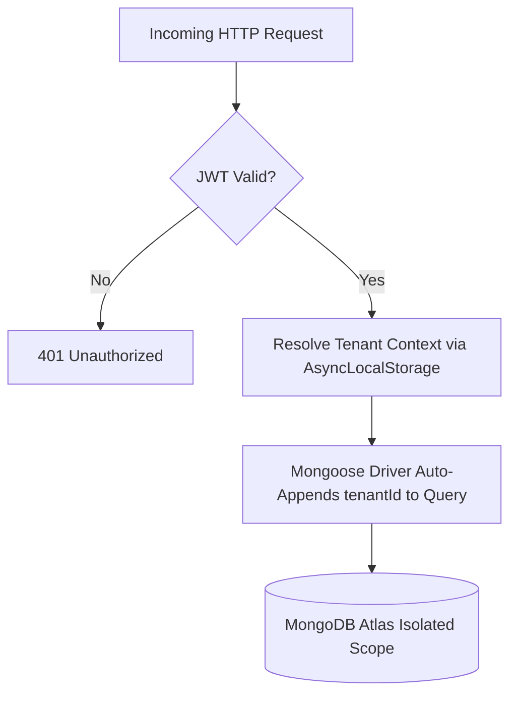
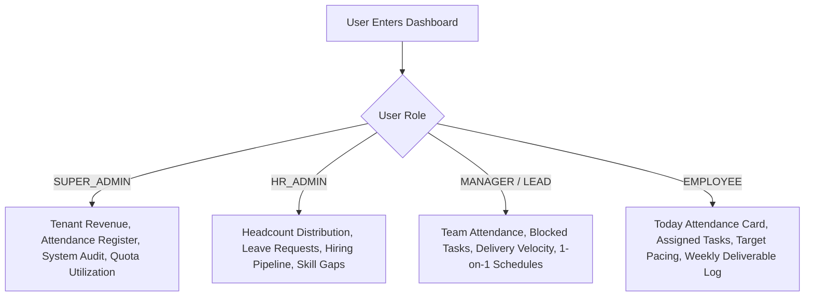
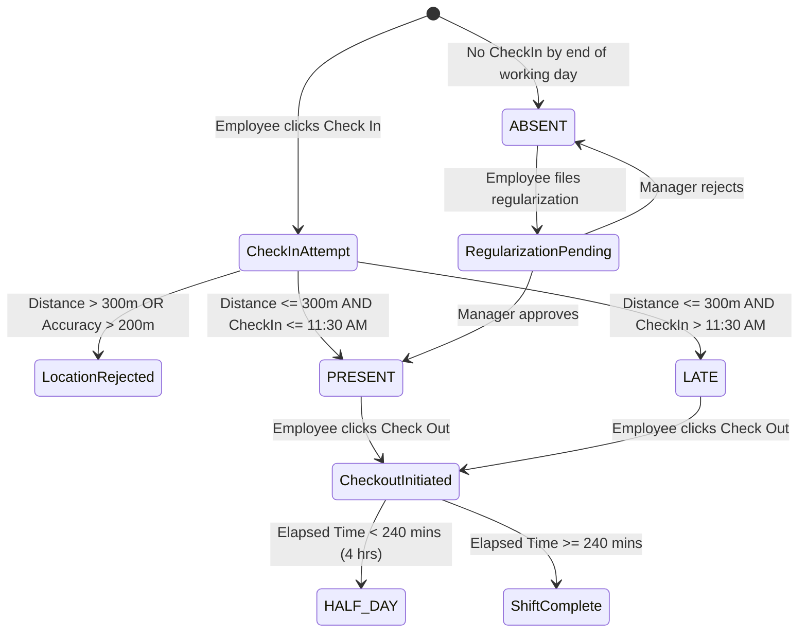
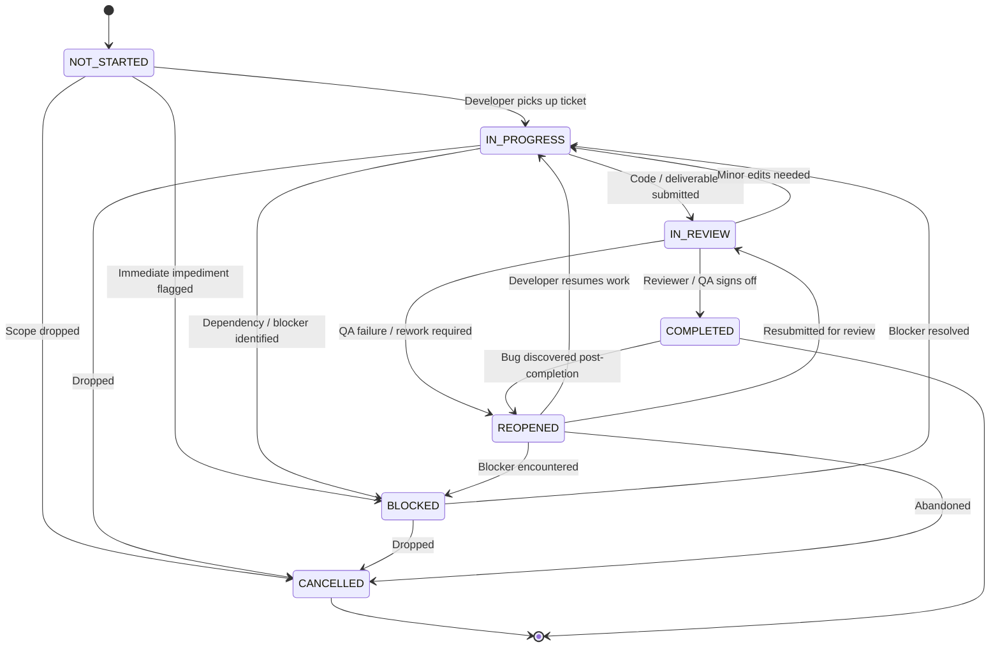
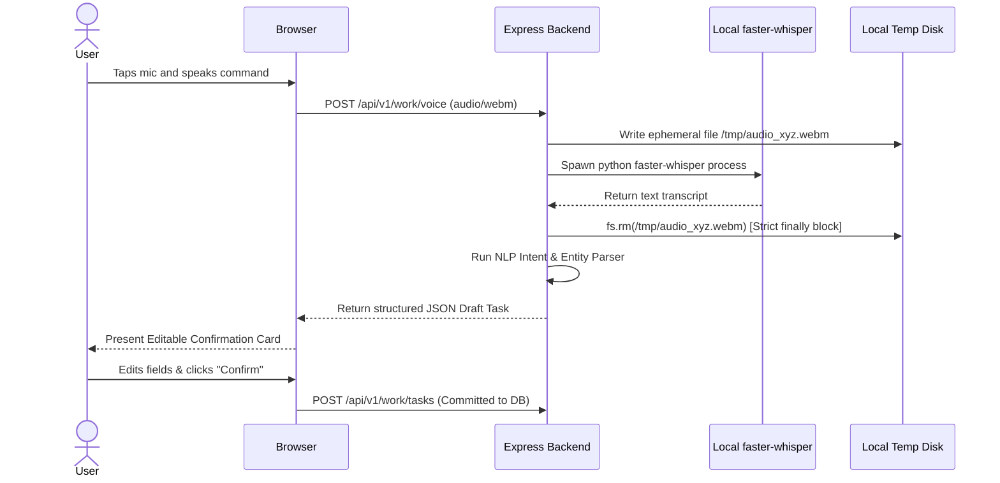
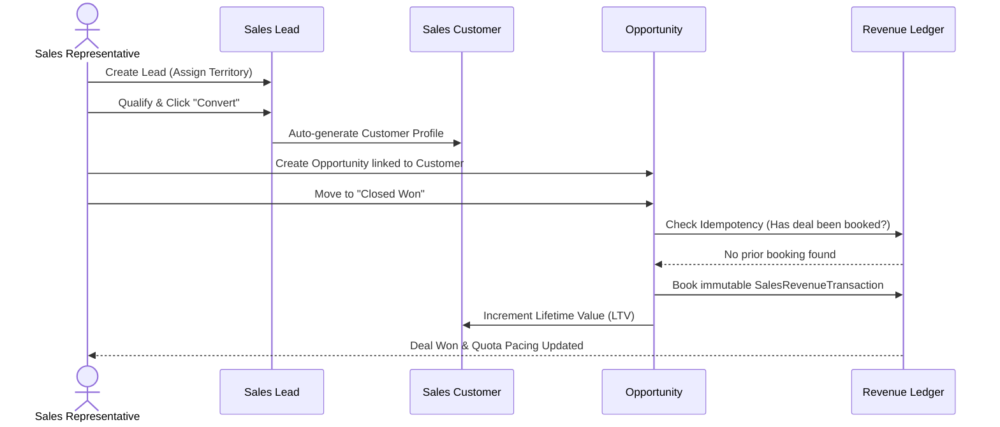

# MobiusEMS: Complete Enterprise Feature Explanation Manual
**A Definitive Functional and Technical Operating Guide to Every System Capability**  
*Mobius Bloom Venture Pvt Ltd | Global Engineering & Product Division*  
*Product Version: v2.0.0-PROD | Target Platform: `https://employee.whalexy.com`*  
*Target Audience: Executive Leadership, Product Managers, Operations Teams, HR Administrators, Engineering Teams, Auditors*

---

# Table of Contents
1. [Executive Summary & Architectural Foundations](#chapter-1-executive-summary--architectural-foundations)
2. [Multi-Tenancy, Platform Administration & Identity Management](#chapter-2-multi-tenancy-platform-administration--identity-management)
3. [Role-Adaptive Executive & Employee Cockpit](#chapter-3-role-adaptive-executive--employee-cockpit)
4. [Workforce & Organization Hierarchy](#chapter-4-workforce--organization-hierarchy)
5. [Smart Geofenced Attendance & Leave Management](#chapter-5-smart-geofenced-attendance--leave-management)
6. [Project Delivery, Task Kanban & Activity Auditing](#chapter-6-project-delivery-task-kanban--activity-auditing)
7. [Local Zero-Retention Voice-to-Task Capture](#chapter-7-local-zero-retention-voice-to-task-capture)
8. [Capability Matrix, Skill Builder & Timed Assessments](#chapter-8-capability-matrix-skill-builder--timed-assessments)
9. [Objective Performance Management & Snapshots](#chapter-9-objective-performance-management--snapshots)
10. [Continuous Contribution Intelligence](#chapter-10-continuous-contribution-intelligence)
11. [Commercial Sales Intelligence & 7-Tier GIS](#chapter-11-commercial-sales-intelligence--7-tier-gis)
12. [Sales Pipeline, Quotas & Deduplicated Revenue Ledger](#chapter-12-sales-pipeline-quotas--deduplicated-revenue-ledger)
13. [Channel Partner Ecosystem](#chapter-13-channel-partner-ecosystem)
14. [Talent Acquisition, JD Library & Resume Screener](#chapter-14-talent-acquisition-jd-library--resume-screener)
15. [People Operations, Growth, Culture & Gamification](#chapter-15-people-operations-growth-culture--gamification)
16. [Enterprise Governance, Security & Tamper-Evident Audit](#chapter-16-enterprise-governance-security--tamper-evident-audit)
17. [Ethical AI Assistant & Multi-Step Email Automation](#chapter-17-ethical-ai-assistant--multi-step-email-automation)

---

# Chapter 1: Executive Summary & Architectural Foundations

### 1.1 Purpose & Problem Statement
Growing enterprises face the **"5-Tool Trap"**: using separate, uncoordinated software for biometric attendance, project management (Jira/Trello), annual performance reviews (spreadsheets), commercial CRM (Salesforce/HubSpot), and talent acquisition. This fragmentation leads to:
* Data silos and manual re-entry errors across HR and finance.
* Inability to link daily delivery and sprint velocity to quarterly employee evaluations.
* Disconnected field sales operations where won deals have no relationship to workforce capacity or realized revenue ledgers.
* Heavy recurring SaaS fees for single-purpose tools.

**MobiusEMS** unifies workforce operations, daily project delivery, verified GPS attendance, commercial territory sales, and human capital growth into a single, multi-tenant operating platform.

### 1.2 The Three Non-Negotiable Engineering Principles
1. **Deterministic Mathematics Over Hallucinatory AI**:
   All performance scores, attendance validations, sales territory quotas, commission calculations, and contribution percentiles are computed via transparent mathematical formulas. LLMs are strictly relegated to an advisory role (drafting narrative review summaries, handbook Q&A) and are structurally barred from executing binding decisions regarding compensation, promotions, disciplinary measures, or terminations.
2. **Respectful Accountability Over Invasive Surveillance**:
   The platform rejects invasive surveillance software (no background keyloggers, screen scrapers, or continuous GPS stalking). Accountability is verified at two clear points:
   - Physical presence during shift boundaries via browser-based geofencing within 300 meters of registered offices.
   - Verifiable delivery through peer-reviewed tasks, blocker escalation logs, and commercial revenue generation.
3. **Built-In Data Privacy & Local Zero-Retention Voice**:
   Speech transcription runs on local hardware using `faster-whisper`. Ephemeral audio files are processed in memory and shredded from disk in strict `finally` code blocks, preventing audio retention and eliminating third-party API exposure.

---

# Chapter 2: Multi-Tenancy, Platform Administration & Identity Management

### 2.1 Overview & Business Purpose
MobiusEMS is built from the ground up as a hardened, multi-tenant SaaS application. It allows independent organizations (e.g., Google, Mobius Bloom, Partner Enterprises) to operate within a shared physical database infrastructure while guaranteeing total cryptographic and logical isolation.

### 2.2 System Architecture & Tenant Isolation
* **Isolation Layer**: Built on Node.js `AsyncLocalStorage` and Mongoose model proxies. When an incoming HTTP request is authenticated, the tenant context is established in execution memory:
  ```typescript
  // Tenant context injection in tenancy middleware
  tenantStorage.run({ tenantId: resolvedTenant.id }, next);
  ```
* **Fail-Closed Design**: Every database query, aggregation pipeline, update, and insert automatically injects `{ tenantId }`. If an unauthenticated or cross-tenant query is attempted without an active context, the driver immediately throws a `403 Forbidden` (`TENANT_CONTEXT_MISSING`). Insecure Direct Object References (IDOR) are structurally impossible.



### 2.3 Subscription Plans & Feature Gating
Organizations are provisioned under explicit plan tiers that govern user seat limits, storage allocations, and module access:

| Plan Tier | Max Employees | Max Storage | AI Workspace | Sales CRM & GIS | Email Automation | Custom Roles |
| :--- | :---: | :---: | :---: | :---: | :---: | :---: |
| **STARTER** | 15 | 2 GB | ❌ | ❌ | ❌ | ❌ |
| **STANDARD** | 50 | 10 GB | ✅ | ❌ | ❌ | ❌ |
| **PROFESSIONAL** | 150 | 50 GB | ✅ | ✅ | ✅ | ✅ |
| **ENTERPRISE** | Unlimited (0) | Unlimited (0) | ✅ | ✅ | ✅ | ✅ |
| **CUSTOM** | Tailored | Tailored | ✅ | ✅ | ✅ | ✅ |

### 2.4 User Onboarding & Session Security
1. **Self-Serve Registration & Tenant Provisioning** (`/register`, `/platform/tenants`):
   - Creates a new `Tenant` record with a unique slug and provisions the initial `SUPER_ADMIN` user.
2. **Employee Provisioning & Invitation**:
   - HR or Super Admin creates an employee record with an email address.
   - The platform generates a secure, randomized temporary password and emails an invitation.
   - Flags `forcePasswordChange: true` and `onboardingComplete: false`.
3. **First-Login Enforcement** (`/change-password`, `/onboarding`):
   - Authenticated routes redirect the user directly to the password change screen.
   - Upon successful password update, the user completes an onboarding wizard (verifying emergency contacts, statutory identity documents, and profile bio).
4. **Hardened Rotating Session Lifecycle**:
   - **Access Token**: Short-lived (15 minutes), stateless JWT containing user ID, role, permissions, and tenant ID.
   - **Refresh Token**: Long-lived (7 days), stored in an `HttpOnly`, `SameSite=Strict`, `Secure` cookie.
   - **Reuse Detection**: Refresh tokens are tracked in `RefreshSession`. If a previously used refresh token is presented, the system treats it as a token theft event and invalidates the entire session family immediately.

---

# Chapter 3: Role-Adaptive Executive & Employee Cockpit

### 3.1 Overview
The primary landing dashboard (`/`) dynamically adapts its layout, widgets, and KPI summaries according to the authenticated user's assigned role (`SUPER_ADMIN`, `HR_ADMIN`, `DEPARTMENT_HEAD`, `MANAGER`, `TEAM_LEAD`, `EMPLOYEE`).



### 3.2 Key Dashboard Widgets
1. **Attendance Quick-Action Widget**:
   - Displays today's date, current office geofence status, and instant "Check In" / "Check Out" buttons with live shift timers.
2. **Task Delivery & Velocity Summary**:
   - Shows active tasks categorized by status (`IN_PROGRESS`, `BLOCKED`, `IN_REVIEW`), highlighting tasks approaching deadline.
3. **Commercial Pacing (Sales Roles)**:
   - For employees with commercial access, renders monthly target quota, achieved revenue, and pacing percentage ($(\text{Achieved} / \text{Target}) \times 100$).
4. **Executive Health Strip (Admins)**:
   - Renders total active headcount, present employees today, open blockers across all projects, and monthly revenue bookings.

---

# Chapter 4: Workforce & Organization Hierarchy

### 4.1 Organizational Data Structure
The organization is modeled as a connected graph across four primary entities:
1. **Departments** (`Department`): High-level functional divisions (e.g., Engineering, Sales, Human Resources, Finance) with assigned Department Heads.
2. **Teams** (`Team`): Working units within a department led by Team Leads.
3. **Designations** (`Designation`): Job titles with defined hierarchy levels, job grades, and required skill profiles.
4. **Employees** (`Employee`): Individual personnel profiles linked to a Department, Team, Designation, and a direct Reporting Manager.

### 4.2 Visual Organizational Hierarchy (`/hierarchy`)
* Renders an interactive, dynamic tree visualization of the entire company reporting structure.
* Supports recursive hierarchy traversing up to $N$ levels from the CEO/Managing Director down to individual contributors.
* Allows managers to inspect sub-teams, headcount distribution, and vacant positions.

### 4.3 Employee 360 Longitudinal Profile (`/employees/:id`)
Every employee profile acts as an immutable, lifelong record connecting:
* **Personal & Statutory Details**: Date of birth, emergency contacts, PAN/Aadhaar/Tax ID, bank account details.
* **Longitudinal Timeline** (`EmployeeTimeline`): Chronological log of promotions, designation changes, salary revisions, department transfers, and milestone awards.
* **Profile Completion Engine** (`profileCompletionService.ts`):
  Evaluates required profile attributes to compute an objective profile health percentage:
  $$\text{Completion \%} = \left( \frac{\text{Completed Mandatory Fields}}{\text{Total Mandatory Fields}} \right) \times 100$$
  Incomplete profiles trigger automated prompts during weekly check-ins.

---

# Chapter 5: Smart Geofenced Attendance & Leave Management

### 5.1 Overview & Value Proposition
MobiusEMS eliminates physical biometric fingerprint hardware. Employees check in directly from their mobile or desktop browser. The platform verifies their physical presence at the designated office using mathematical geofencing.

### 5.2 Mathematical Formulation & Business Rules

#### 1. The Haversine Spherical Distance Formula
When an employee taps **"Check In"**, the browser transmits the device's HTML5 coordinates $(\text{lat}_1, \text{lon}_1)$ along with the estimated accuracy in meters. The server calculates the great-circle distance $d$ to the configured primary office $(\text{lat}_2, \text{lon}_2)$ using Earth's radius $R = 6,371,000\text{ meters}$:

$$\Delta\phi = \frac{(\text{lat}_2 - \text{lat}_1) \cdot \pi}{180}, \quad \Delta\lambda = \frac{(\text{lon}_2 - \text{lon}_1) \cdot \pi}{180}$$

$$a = \sin^2\left(\frac{\Delta\phi}{2}\right) + \cos\left(\frac{\text{lat}_1 \cdot \pi}{180}\right) \cdot \cos\left(\frac{\text{lat}_2 \cdot \pi}{180}\right) \cdot \sin^2\left(\frac{\Delta\lambda}{2}\right)$$

$$d = 2 \cdot R \cdot \operatorname{atan2}\left(\sqrt{a}, \sqrt{1-a}\right)$$

#### 2. Validation Constraints
* **Geofence Check**: If $d > 300\text{ meters}$, check-in is rejected with HTTP `403 Forbidden` (`OUTSIDE_ATTENDANCE_GEOFENCE`).
* **GPS Anti-Spoofing Guard**: If the reported device accuracy is $> 200\text{ meters}$, check-in is rejected with HTTP `422 Unprocessable Entity` (`LOCATION_ACCURACY_LOW`), preventing the use of software location spoofers and mock location apps.
* **Late Arrival Rule**:
  * Check-in time evaluated in Indian Standard Time (`Asia/Kolkata`).
  * If $\text{Check-in Time} \le 11:30\text{ AM IST} \implies \text{Status} = \mathbf{PRESENT}$.
  * If $\text{Check-in Time} > 11:30\text{ AM IST} \implies \text{Status} = \mathbf{LATE}$.
* **Half-Day Shift Demotion**:
  * Upon checkout, shift duration is calculated:
    $$\text{Worked Minutes} = \left\lfloor \frac{\text{Check-Out Timestamp} - \text{Check-In Timestamp}}{60,000} \right\rfloor$$
  * If $\text{Worked Minutes} < 240\text{ minutes (4 hours)}$, status is automatically demoted to $\mathbf{HALF\_DAY}$.



### 5.3 Attendance Regularization & Leave Workflows
* **Regularization**: When field travel or technical failures prevent check-in, employees submit a regularization claim with supporting notes. The request is routed to the direct manager. Approval overrides daily status and writes a permanent record to `AuditLog`.
* **Leave Requests** (`LeaveRequest`):
  * **Leave Categories**: Privilege Leave (PL), Casual Leave (CL), Sick Leave (SL), and Unpaid Leave.
  * **Validation Engine**: Blocks overlapping leave requests; verifies that requested days do not exceed available balance quotas; updates team availability calendars upon approval.

---

# Chapter 6: Project Delivery, Task Kanban & Activity Auditing

### 6.1 Overview
The Work module (`/work`) provides visual project delivery, sprint tracking, and task lifecycle execution. It bridges the gap between software development/daily task execution and employee performance.

### 6.2 The 7-Stage State Machine
Task transitions are strictly validated in `taskTransitions.ts`. Invalid jumps (e.g., jumping directly from `NOT_STARTED` to `COMPLETED`) are rejected by the API.



### 6.3 Blocker Escalation & Resolution
* Any team member can flag a task as `BLOCKED` by selecting a reason:
  - `EXTERNAL_DEPENDENCY` (e.g., waiting for client API credentials)
  - `DESIGN_ASSETS` (e.g., UI/UX mocks missing)
  - `INFRASTRUCTURE` (e.g., staging server outage)
  - `REQUIREMENT_AMBIGUITY` (e.g., unclear product logic)
* Flagging a blocker surfaces an immediate alert on the Manager and Department Head dashboards.
* External blockers are flagged as `external: true`, which exempts the assigned employee from reliability scoring penalties during contribution reviews.

### 6.4 Cycle Time & Rework Tracking
* **Cycle Time**: Tracks the elapsed wall-clock hours from first entering `IN_PROGRESS` to final `COMPLETED`.
* **Rework Counter**: Increments every time a task transitions from `IN_REVIEW` $\to$ `REOPENED`. High rework counts flag requirement ambiguities or technical debt without relying on subjective opinions.
* **Immutable Activity Stream** (`TaskActivity`): Every status change, priority alteration, assignee reassignment, and comment is logged with actor metadata.

---

# Chapter 7: Local Zero-Retention Voice-to-Task Capture

### 7.1 Architecture & Ethical Privacy Guarantee
To eliminate typing friction for field staff and engineers, MobiusEMS integrates speech-to-task capabilities running **100% locally on the host server** using `faster-whisper`.
* **Zero Cloud Third-Party Exposure**: Audio is never sent to external cloud APIs (Google Speech, Whisper API, AWS Transcribe).
* **Guaranteed Audio Shredding**: The browser records speech in WebM format and uploads it via HTTPS. The server writes the bytes to an ephemeral temporary path (`/tmp/audio_*.webm`), extracts the text transcript, and immediately deletes/shreds the file in a strict `finally` code block. Audio files are never written to long-term storage or Cloudinary.



### 7.2 Multilingual NLP Parser Capabilities
The system parses English, Hindi, and 10 regional Indian languages (Bengali, Tamil, Telugu, Marathi, Gujarati, Kannada, Malayalam, Punjabi, Urdu):
1. **Prospective vs. Retrospective Intent**:
   - Prospective phrases (*"have to complete", "need to finish", "पूरा करना है", "मुடிக்க வேண்டும்"*) $\implies$ Sets action to `CREATE_TASK`.
   - Retrospective phrases (*"completed", "finished", "हो गया", "முடிந்தது"*) $\implies$ Sets action to `UPDATE_STATUS`.
2. **Spoken Number & Duration Extraction**:
   - Converts multilingual speech numbers (e.g., *"two hours"*, *"दो घंटे"*, *"மூன்று மணி நேரம்"*) into floating-point numbers (`actualHours: 2.0`).
3. **Compound Hinglish Splitting**:
   - Identifies multiple instructions in a single sentence (e.g., *"Ayush ko frontend do aur Priya ko backend do"*) and generates distinct draft assignments.
4. **Human-in-the-Loop Confirmation**:
   - Transcripts are **never committed automatically**. An editable modal card displays extracted title, priority, assignee, and estimated hours for user review and sign-off.

---

# Chapter 8: Capability Matrix, Skill Builder & Timed Assessments

### 8.1 Skills Inventory & Taxonomy (`/skills/builder`)
* A standardized competency catalog organized into Technical, Operational, Domain, and Leadership categories.
* Each skill defines 5 proficiency levels (1 = Beginner, 5 = Master/Authority).

### 8.2 Two-Tier Rating System
* **Self-Reported Ratings**: Employees rate their own proficiency (1–5) and provide evidence links (GitHub pull requests, project URLs, certifications). These ratings are tagged as `UNVERIFIED`.
* **Manager / Verifier Approval**: Designees inspect the evidence and approve or adjust the rating. Only verified ratings feed into organizational capability heatmaps and promotion readiness scores.

### 8.3 Departmental Skill Heatmap (`/skill-matrix`)
* Renders a matrix of departments/teams against core skills.
* **Single Point of Failure (SPOF) Detection**: Automatically highlights critical skills possessed by only one person in a department, alerting management to cross-training risks.

### 8.4 Automated Timed Assessments (`/assessments`)
* Enables HR and technical leads to design standardized tests for candidate screening or employee skill benchmarking.
* **Features**:
  - Randomized question pools drawn from tagged categories.
  - Strict countdown timers with automatic submission upon expiry.
  - Automated grading for multiple-choice questions; rubrics for open-ended evaluations.
  - Direct candidate assessment portals (`APPLICANT` role).

---

# Chapter 9: Objective Performance Management & Snapshots

### 9.1 Overview & Elimination of Bias
Traditional annual reviews suffer from recency bias, halo effects, and personal favoritism. MobiusEMS replaces subjective impressions with **deterministic mathematical scoring** anchored in verifiable data collected across the review period.

### 9.2 The Composite Performance Mathematical Formula
The final performance evaluation score is calculated via weighted deterministic aggregation:

$$\text{Final Score} = (\text{Goals Score} \times W_g) + (\text{KPI Score} \times W_k) + (\text{Review Competencies} \times W_r)$$

Where:
* $W_g + W_k + W_r = 1.0$ (configured organizational weights).
* **Goals Achievement**: Percentage completion of assigned cascading goals.
* **KPI Performance**: Bounded achievement across quantifiable key performance indicators:
  $$\text{KPI Achievement} = \max\left(0, \min\left(200, \frac{\text{Actual Metric}}{\text{Target Metric}} \times 100\right)\right)$$
* **Review Competencies**: Normalized score (0–100%) from structured 360-degree peer and manager evaluation rubrics.

### 9.3 Performance Classification Bands
The computed final score automatically maps into strict, non-negotiable performance tiers:
* $\ge \mathbf{90.0\%}$: **Exceptional**
* $\mathbf{75.0\% - 89.9\%}$: **Strong Performer**
* $\mathbf{60.0\% - 74.9\%}$: **Consistent Performer**
* $<\mathbf{60.0\%}$: **Developing / Needs Support**

### 9.4 Cryptographic Immutable Snapshots (`PerformanceSnapshot`)
Once a review cycle is closed by HR:
1. The raw metrics, reviewer feedback, mathematical weights, and final scores are serialized.
2. The snapshot is marked `isImmutable: true` in the database.
3. Any subsequent code updates, goal adjustments, or role changes cannot alter historical review records, ensuring compliance with audit and legal discovery standards.

---

# Chapter 10: Continuous Contribution Intelligence

### 10.1 Overview & Philosophy
Performance should not be evaluated only once a year. The Contribution module (`/contribution`) tracks steady, verifiable weekly delivery.

### 10.2 Weekly Check-In Ritual
Every Friday, employees submit a structured check-in:
* Completed deliverables with links to work tickets.
* Key priorities for the upcoming week.
* Active impediments or blockers.

### 10.3 Algorithmic Contribution Percentiles
The platform computes a normalized contribution percentile across peer cohorts based on:
1. **Deliverable Velocity**: Ratio of planned deliverables completed on time over rolling 30-day and 90-day windows.
2. **Reliability Index**: Proportion of commitments fulfilled, explicitly excluding external blockers (`reliabilityEligible = !task.blocker?.external`).
3. **Quality & Rework Factor**: Penalties applied only when tasks experience excessive rework cycles ($>2$ rework loops).

### 10.4 The Evidence-Coverage Guardrail
MobiusEMS enforces a strict operational principle: **Never confuse missing documentation with poor delivery.**
* If an employee fails to submit weekly updates, the system flags an **"Information Gap"**.
* Managers are prompted to verify delivery before an algorithm artificially depresses the employee's contribution score.

---

# Chapter 11: Commercial Sales Intelligence & 7-Tier GIS

### 11.1 The 7-Tier Geographic Information System (GIS) Hierarchy
Field sales and territory distribution are mapped using a native 7-tier geographic tree (`GeoNode`):

$$\text{Global} \longrightarrow \text{Country} \longrightarrow \text{State} \longrightarrow \text{District} \longrightarrow \text{City} \longrightarrow \text{Area} \longrightarrow \text{Pincode}$$

This hierarchy allows organizations to aggregate sales data, customer concentration, and pipeline value from local pincodes up to national and global levels.

### 11.2 Headcount Capacity & Territory Math
Territory planning uses deterministic capacity math (`salesMath.ts`):

$$\text{Required Headcount} = \left\lceil \frac{\text{Current Lead Load}}{\text{Configured Capacity per Employee}} \right\rceil$$

$$\text{Headcount Gap} = \max(0, \text{Required Headcount} - \text{Active Headcount})$$

$$\text{Capacity Utilization \%} = \frac{\text{Current Lead Load}}{\text{Active Headcount} \times \text{Configured Capacity}} \times 100$$

$$\text{Coverage \%} = \min\left(100, \frac{\text{Active Headcount}}{\text{Required Headcount}} \times 100\right)$$

* When **Capacity Utilization** exceeds $100\%$, territories are flagged as overloaded, prompting leadership to allocate additional sales representatives.

### 11.3 Lead Management & SLA Tracking
* **Lead Ingestion**: Captures prospective buyers with assigned territory, contact details, and initial commercial value.
* **SLA Enforcement**: Measures response times against territory follow-up SLAs.
* **Lost Revenue Algorithm**: Automatically computes the estimated lost revenue when leads languish in `NEW` or `CONTACTED` status past agreed SLA thresholds, highlighting missed revenue opportunities to sales leadership.

---

# Chapter 12: Sales Pipeline, Quotas & Deduplicated Revenue Ledger

### 12.1 Commercial Opportunity Pipeline
Opportunities move through 5 structured stages:
$$\text{Prospecting} \longrightarrow \text{Qualification} \longrightarrow \text{Proposal} \longrightarrow \text{Negotiation} \longrightarrow \text{Closed Won} \; / \; \text{Closed Lost}$$

* Moving a deal to `Closed Lost` mandates entering a verified `lossReason` (e.g., Competitor Price, Feature Gap, Budget Cancelled) to inform product and sales strategy.

### 12.2 Lead Conversion & Customer Creation
When a lead reaches `CONVERTED`:
1. The system automatically provisions a linked `SalesCustomer` record.
2. Contact details, territory, and currency are inherited directly.
3. Future opportunities and quotes are anchored to this customer profile.

### 12.3 Deduplicated Realized Revenue Ledger
When an opportunity is marked `Closed Won`:
1. An immutable `SalesRevenueTransaction` is recorded.
2. Customer lifetime value ($\text{LTV}$) is updated automatically.
3. **Idempotency Lock**: The transaction logic checks for existing revenue records for that opportunity ID. Repeated requests cannot generate duplicate revenue entries.
4. Manual revenue entries are restricted to `SUPER_ADMIN` with mandatory audit justification.



### 12.4 Targets, Commitments & Reminders
* **Target Allocation**: Sales leadership sets monthly, quarterly, or annual targets for territories and individual reps.
* **Digital Sign-Off** (`EmployeeTargetCommitment`): Sales reps digitally review and accept their assigned quota targets.
* **Target Reminders** (`TargetReminderLog`): Automated background jobs alert reps and managers to quota pacing milestones.

### 12.5 The Multi-Tier Sales Compensation Engine
The platform includes an advanced compensation engine supporting 5 distinct calculation models:

| Model | Calculation Method | Use Case |
| :--- | :--- | :--- |
| **PROPORTIONAL** | Payout scales linearly with quota achievement up to a maximum cap. | Standard inside sales teams. |
| **COMMISSION_SLABS** | Tiered rates (e.g., $0-80\% = 2\%$, $80-100\% = 5\%$, $>100\% = 8\%$). | Enterprise field sales. |
| **FLAT_COMMISSION** | Fixed percentage of all closed-won revenue. | High-velocity transactional sales. |
| **TARGET_GATE** | Zero payout unless $\text{Achievement} \ge 100\%$; accelerated rate thereafter. | High-quota executive sales. |
| **HYBRID** | Fixed base allocation + tiered commission slabs + performance bonus. | Multi-tier distributed sales networks. |

* **Accelerators & Caps**: Supports performance accelerators (multipliers applied above $100\%$ quota) and floor/ceiling safety caps to protect corporate budgets.

---

# Chapter 13: Channel Partner Ecosystem

### 13.1 Overview
Organizations operating indirect sales channels can manage distributor, dealer, and reseller networks inside the same platform (`ChannelPartner`).

### 13.2 Key Capabilities
* **Partner Profiles**: Maintain legal entity details, GSTIN/Tax IDs, commercial agreements, and commission structures.
* **Territory Coverage**: Assign channel partners to specific geographic territories (Districts, States, or National).
* **Partner-Attributed Revenue**: Connect won opportunities directly to referring partners to compute partner payouts and track indirect revenue contribution.

---

# Chapter 14: Talent Acquisition, JD Library & Resume Screener

### 14.1 Standardized Job Description Library (`/resumes`)
* Centralized repository of approved JD templates.
* Defines minimum years of experience, core skill requirements, preferred qualifications, and compensation bands.

### 14.2 Candidate Applicant Pipeline (`/applicants`)
* Tracks candidates across defined hiring stages:
  $$\text{Sourced} \longrightarrow \text{Screened} \longrightarrow \text{Interviewing} \longrightarrow \text{Offer Extended} \longrightarrow \text{Hired} \; / \; \text{Rejected}$$
* Upon moving a candidate to `Hired`, HR can convert the candidate profile into an active `Employee` record with a single click, transferring resume data into their Employee 360 profile.

### 14.3 Automated Resume Screening Engine (`/resume-screener`)
1. Recruiter uploads candidate resumes in PDF or DOCX format.
2. The server extracts raw text using document parsers.
3. The screening engine compares candidate text against the target JD's skill taxonomy and experience parameters.
4. Generates an **Advisory Qualification Score** detailing:
   - Verified matching skills
   - Missing required skills
   - Years of experience estimate
5. **Human Recruiter Gate**: The score is strictly advisory. The system does not automatically reject candidates; final interview selections remain in human hands.

---

# Chapter 15: People Operations, Growth, Culture & Gamification

### 15.1 Structured 1-on-1 Workspace (`/development`)
* Replaces ad-hoc meetings with structured, recurring 1-on-1 agendas.
* Features shared agendas, mutually agreed action items with due dates, and **Private Manager Notes** for continuous coaching notes.

### 15.2 Internal Training Catalog & Certifications
* Centralized catalog of internal courses, technical workshops, and external training programs.
* Tracks enrollment, attendance, and completion certificates.
* Completed courses automatically link to the employee's profile and update their verified skill matrix.

### 15.3 Core-Value Peer Recognitions (`/people-ops`)
* A company-wide recognition board where employees and managers celebrate colleagues who exemplify corporate values (e.g., Integrity, Customer Obsession, Innovation).
* Recognitions are visible across the company and feed into periodic culture awards.

### 15.4 Private Daily To-Dos
* A lightweight personal daily task planner for individual employees.
* **Strict Privacy Rule**: Personal to-do lists are private to the individual and are strictly excluded from performance reviews and manager visibility.

### 15.5 Employee Gamification (`EmployeeGamification`)
* Earn points and badges for timely attendance, sprint completion, skill certifications, and peer recognitions.
* Departmental and company-wide leaderboards encourage healthy engagement.

---

# Chapter 16: Enterprise Governance, Security & Tamper-Evident Audit

### 16.1 Tamper-Evident Audit Trail (`/governance`)
Every critical operation across the platform writes an immutable record to `AuditLog`:
* **Actor Metadata**: User ID, assigned role, IP address, user-agent string.
* **Action Classification**: Check-ins, role changes, salary revisions, task state transitions, AI requests, document downloads.
* **State Diff**: Full JSON delta capturing `oldValue` and `newValue`.
* **Tamper Resistance**: Audit log records have no update or delete API endpoints.

### 16.2 Granular Role-Based Access Control (RBAC)
Access is enforced across **22 Section Permissions** and fine-grained action keys (`PERMISSIONS`):

| Permission Domain | Super Admin | HR Admin | Dept Head | Manager | Team Lead | Employee |
| :--- | :---: | :---: | :---: | :---: | :---: | :---: |
| **Tenant Settings & Subscription** | ✅ | Read Only | ❌ | ❌ | ❌ | ❌ |
| **Attendance Register & Config** | ✅ | View All | View Dept | View Team | View Team | Self Only |
| **Employee Directory & Edits** | ✅ | ✅ | Read Dept | Read Team | Read Team | Self Profile |
| **Task Creation & Assignment** | ✅ | ✅ | ✅ | ✅ | ✅ | Update Own |
| **Performance Reviews & Scoring**| ✅ | ✅ | ✅ | ✅ | Review Only | View Own |
| **Sales CRM (Full Operations)** | ✅ | View Only | Team Scope | Team Scope| Team Scope| Self Scope |
| **Resume Screener & Hiring** | ✅ | ✅ | Read Only | Read Only | ❌ | ❌ |
| **Audit Logs Inspection** | ✅ | ❌ | ❌ | ❌ | ❌ | ❌ |

### 16.3 Authenticated Private Document Storage
* Identity proofs, employment contracts, and resumes are stored in Cloudinary private buckets with randomized cryptographic keys.
* Direct public URL access is completely disabled.
* Document access requires an authenticated API request: the backend validates the user's role and tenant, then issues a time-limited (15-minute) signed download URL.

---

# Chapter 17: Ethical AI Assistant & Multi-Step Email Automation

### 17.1 Company Handbook & Policy Q&A Assistant (`/ai-workspace`)
* Grounded in uploaded company policies, employee handbooks, and leave guidelines.
* Uses retrieval-augmented generation (RAG) to provide exact, cited answers to employee questions (e.g., *"How many casual leaves can I carry forward?"*).
* **Escalation Trigger**: If a question falls outside documented policy, the assistant prompts the employee to raise a ticket with HR rather than guessing.

### 17.2 Advisory Review Summaries
* Synthesizes quarterly raw data (completed tasks, blocker logs, attendance percentages, KPI attainment) into a coherent review draft for managers.
* **Ethical Boundary**: Managers must manually review, edit, and sign off on all drafts. The system bars AI from executing automated grading or personnel actions.

### 17.3 Multi-Step Email Drip Automation (`/email-automation`)
* Designed for candidate communications, vendor outreach, and customer nurturing.
* Integrates with Brevo via transactional APIs.
* **Workflow Logic**:
  - Multi-step sequence steps with configurable delays (e.g., Day 1: Welcome $\to$ Day 3: Follow-Up).
  - **Automatic Stop Conditions**: Sequences immediately halt if the recipient replies, unsubscribes, or if the email bounces.

---

# Chapter 18: Operational Verification & Quality Checklist

For quality assurance and systems audits, verify every module against the following operational criteria:

1. **Multi-Tenancy**: Ensure no database query can execute without an authenticated tenant context.
2. **Attendance**: Verify that coordinates outside 300 meters or accuracy $>200\text{m}$ are rejected with appropriate error codes.
3. **Voice Shredding**: Inspect server temp directories to ensure no audio files persist after voice-to-task commands.
4. **Performance Calculations**: Verify that performance scores match the mathematical formula within $0.1\%$ precision.
5. **Revenue Ledger**: Verify that moving an opportunity to `Closed Won` books exactly one revenue transaction, and that repeated submissions are rejected.
6. **Audit Trail**: Confirm that all sensitive mutations generate a corresponding `AuditLog` entry.

---
*End of MobiusEMS Complete Enterprise Feature Explanation Manual v2.0*
